# 一、SSM-CRUD
- ssm：SpringMVC+Spring+MyBatis
- CRUD：Create（创建）
- Retrieve（查询）
- Update（更新）
- Delete（删除）


# 二、功能点
1. 分页
2. 数据校验
3. jquery前端校验 + JSR303后端校验
4. ajax
5. Rest风格的URI；使用HTTP协议请求方式的动词，来表示对资源的操作（GET（查询），POST（新增），PUT（修改），DELETE（删除））


# 三、技术点
1. 基础框架：ssm（SpringMVC + Spring + MyBatis）
2. 数据库：MySQL
3. 前端框架：bootstrap 快速搭建简洁美观的界面
4. 项目的依赖管理：Maven
5. 分页：agehelper 插件
6. 逆向工程：MyBatis Generator


# 四、基础环境搭建

## 1、创建一个maven工程

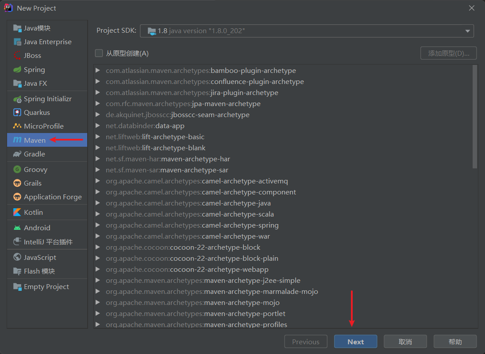

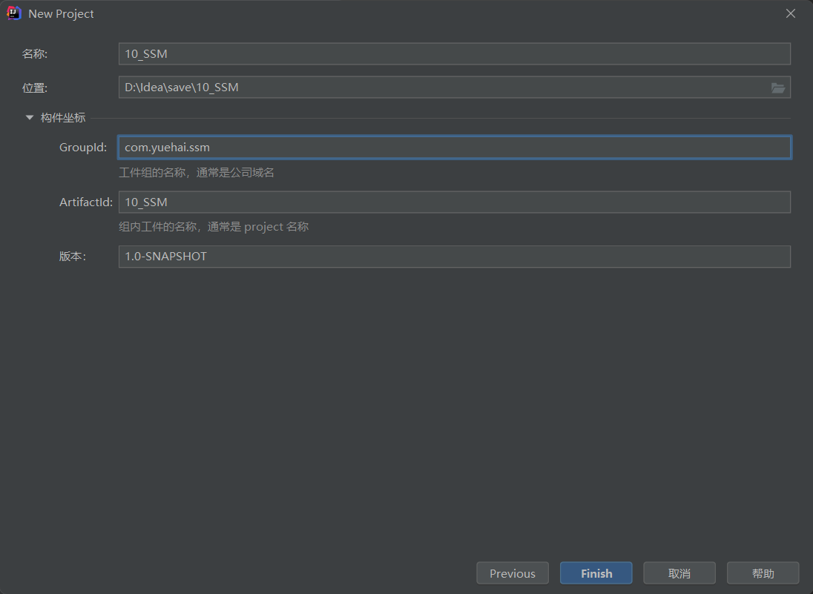


## 2、修改 Maven 设置

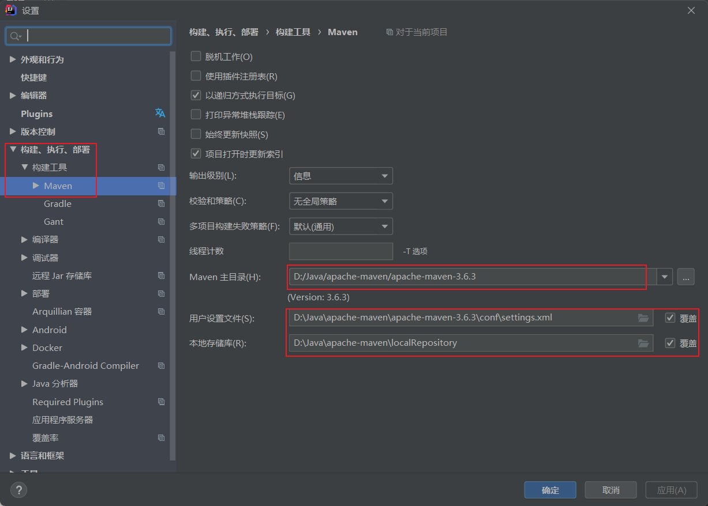


## 3、添加 web 构件

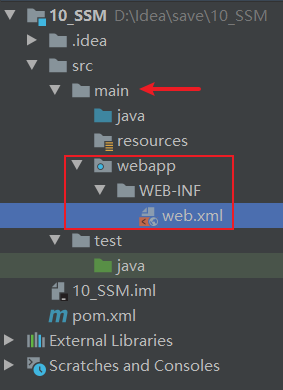


## 4、引入项目依赖的jar包，pom.xml 文件：
   - spring
   - springmvc
   - mybatis
   - 数据库连接池，驱动包
   - 其他（jstl，servlet-api，junit）

```xml
    <?xml version="1.0" encoding="UTF-8"?>
    <project xmlns="http://maven.apache.org/POM/4.0.0"
            xmlns:xsi="http://www.w3.org/2001/XMLSchema-instance"
            xsi:schemaLocation="http://maven.apache.org/POM/4.0.0 http://maven.apache.org/xsd/maven-4.0.0.xsd">
        <modelVersion>4.0.0</modelVersion>

        <groupId>org.example</groupId>
        <artifactId>10_SSM</artifactId>
        <version>1.0-SNAPSHOT</version>
        <!-- 打包方式为 war 包 -->
        <packaging>war</packaging>

        <!--引入项目依赖的jar包 -->
        <dependencies>

            <!-- Spring面向切面编程 -->
            <!-- https://mvnrepository.com/artifact/org.springframework/spring-aspects -->
            <dependency>
                <groupId>org.springframework</groupId>
                <artifactId>spring-aspects</artifactId>
                <version>4.3.7.RELEASE</version>
            </dependency>
            <!-- Spring-jdbc：事务控制 -->
            <!-- https://mvnrepository.com/artifact/org.springframework/spring-jdbc -->
            <dependency>
                <groupId>org.springframework</groupId>
                <artifactId>spring-jdbc</artifactId>
                <version>4.3.7.RELEASE</version>
            </dependency>
            <!-- Spring-test -->
            <!-- https://mvnrepository.com/artifact/org.springframework/spring-test -->
            <dependency>
                <groupId>org.springframework</groupId>
                <artifactId>spring-test</artifactId>
                <version>4.3.7.RELEASE</version>
            </dependency>

            <!-- SpringMVC -->
            <dependency>
                <groupId>org.springframework</groupId>
                <artifactId>spring-webmvc</artifactId>
                <version>4.3.7.RELEASE</version>
            </dependency>

            <!-- MyBatis -->
            <!-- https://mvnrepository.com/artifact/org.mybatis/mybatis -->
            <dependency>
                <groupId>org.mybatis</groupId>
                <artifactId>mybatis</artifactId>
                <version>3.4.2</version>
            </dependency>

            <!-- MyBatis 与 Spring 整合的适配包 -->
            <!-- https://mvnrepository.com/artifact/org.mybatis/mybatis-spring -->
            <dependency>
                <groupId>org.mybatis</groupId>
                <artifactId>mybatis-spring</artifactId>
                <version>1.3.1</version>
            </dependency>

            <!-- 数据库连接池驱动，阿里的德鲁伊 -->
            <!-- https://mvnrepository.com/artifact/com.alibaba/druid -->
            <dependency>
                <groupId>com.alibaba</groupId>
                <artifactId>druid</artifactId>
                <version>1.2.8</version>
            </dependency>

            <!-- MySQL 数据库驱动 -->
            <!-- https://mvnrepository.com/artifact/mysql/mysql-connector-java -->
            <dependency>
                <groupId>mysql</groupId>
                <artifactId>mysql-connector-java</artifactId>
                <version>5.1.41</version>
            </dependency>

            <!-- JSTL -->
            <!-- https://mvnrepository.com/artifact/jstl/jstl -->
            <dependency>
                <groupId>jstl</groupId>
                <artifactId>jstl</artifactId>
                <version>1.2</version>
            </dependency>

            <!-- servlet-api，前端 jsp 页面需要 -->
            <!-- https://mvnrepository.com/artifact/javax.servlet/javax.servlet-api -->
            <dependency>
                <groupId>javax.servlet</groupId>
                <artifactId>javax.servlet-api</artifactId>
                <version>3.0.1</version>
                <scope>provided</scope>
            </dependency>

            <!-- 引入 pageHelper 分页插件 -->
            <dependency>
                <groupId>com.github.pagehelper</groupId>
                <artifactId>pagehelper</artifactId>
                <version>5.0.0</version>
            </dependency>

            <!-- MBG，MyBatis 的逆向工程代码生成器 -->
            <!-- https://mvnrepository.com/artifact/org.mybatis.generator/mybatis-generator-core -->
            <dependency>
                <groupId>org.mybatis.generator</groupId>
                <artifactId>mybatis-generator-core</artifactId>
                <version>1.3.5</version>
            </dependency>

            <!-- 返回 json 字符串的支持 -->
            <!-- https://mvnrepository.com/artifact/com.fasterxml.jackson.core/jackson-databind -->
            <dependency>
                <groupId>com.fasterxml.jackson.core</groupId>
                <artifactId>jackson-databind</artifactId>
                <version>2.8.8</version>
            </dependency>

            <!--JSR303数据校验支持；tomcat7及以上的服务器，
            tomcat7以下的服务器：el表达式。额外给服务器的lib包中替换新的标准的el-->
            <!-- https://mvnrepository.com/artifact/org.hibernate/hibernate-validator -->
            <dependency>
                <groupId>org.hibernate</groupId>
                <artifactId>hibernate-validator</artifactId>
                <version>5.4.1.Final</version>
            </dependency>

            <!-- junit -->
            <!-- https://mvnrepository.com/artifact/junit/junit -->
            <dependency>
                <groupId>junit</groupId>
                <artifactId>junit</artifactId>
                <version>4.12</version>
            </dependency>

        </dependencies>

    </project>
```


## 5、引入 bootstrap 前端框架
```html
    <%@ page contentType="text/html;charset=UTF-8" language="java" %>
    <html>
    <head>
        <meta charset="utf-8">
        <meta http-equiv="X-UA-Compatible" content="IE=edge">
        <meta name="viewport" content="width=device-width, initial-scale=1">
        <!-- 上述3个meta标签*必须*放在最前面，任何其他内容都*必须*跟随其后！ -->

        <title>首页</title>

        <!-- Bootstrap 引入在线的 css 样式 -->
        <link rel="stylesheet" href="https://stackpath.bootstrapcdn.com/bootstrap/3.4.1/css/bootstrap.min.css"
            integrity="sha384-HSMxcRTRxnN+Bdg0JdbxYKrThecOKuH5zCYotlSAcp1+c8xmyTe9GYg1l9a69psu"
            crossorigin="anonymous">

    </head>
    <body>

    <%-- 使用 Bootstrap 样式的按钮 --%>
    <%-- 官方文档：https://v3.bootcss.com/css/#buttons --%>
    <button type="button" class="btn btn-primary">按钮</button>

    </body>

    <!-- Bootstrap 引入在线的 jQuery 和 Bootstrap 的所有 JavaScript 插件 -->
    <!-- jQuery (Bootstrap 的所有 JavaScript 插件都依赖 jQuery，所以必须放在前边) -->
    <script src="https://fastly.jsdelivr.net/npm/jquery@1.12.4/dist/jquery.min.js"
            integrity="sha384-nvAa0+6Qg9clwYCGGPpDQLVpLNn0fRaROjHqs13t4Ggj3Ez50XnGQqc/r8MhnRDZ"
            crossorigin="anonymous"></script>
    <!-- 加载 Bootstrap 的所有 JavaScript 插件。你也可以根据需要只加载单个插件。 -->
    <script src="https://stackpath.bootstrapcdn.com/bootstrap/3.4.1/js/bootstrap.min.js"
            integrity="sha384-aJ21OjlMXNL5UyIl/XNwTMqvzeRMZH2w8c5cRVpzpU8Y5bApTppSuUkhZXN0VxHd"
            crossorigin="anonymous"></script>

    </html>
```


## 6、创建数据库及数据库表

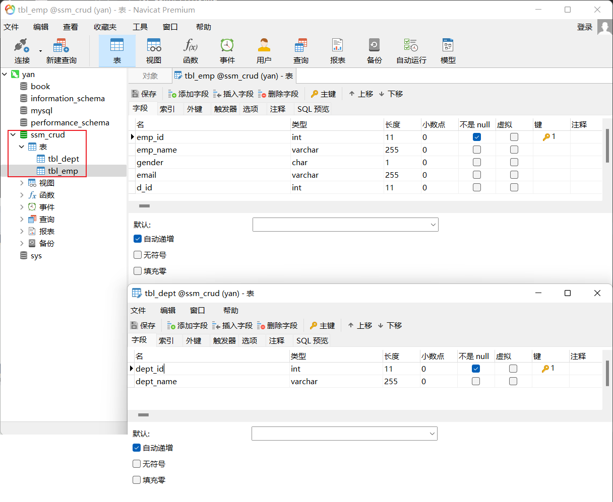


## 7、编写 ssm 整合的关键配置文件
- web.xml，spring、springmvc、mybatis 的配置文件
1. 项目结构：

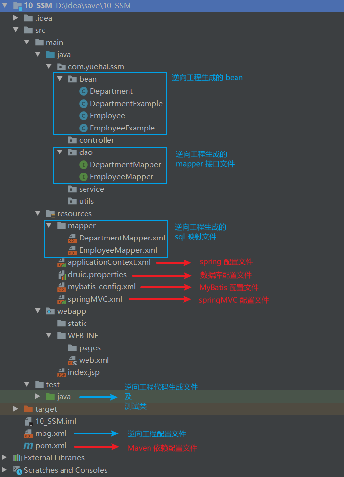

2. web.xml
```xml
    <?xml version="1.0" encoding="UTF-8"?>
    <web-app xmlns="http://xmlns.jcp.org/xml/ns/javaee"
            xmlns:xsi="http://www.w3.org/2001/XMLSchema-instance"
            xsi:schemaLocation="http://xmlns.jcp.org/xml/ns/javaee http://xmlns.jcp.org/xml/ns/javaee/web-app_4_0.xsd"
            version="4.0">

        <!-- 1、监听器，启动 Spring 的容器，让项目一启动就启动 Spring 的容器 -->
        <context-param>
            <param-name>contextConfigLocation</param-name>
            <param-value>classpath:applicationContext.xml</param-value>
        </context-param>
        <!--
            作用：启动 Web 容器时，读取在 contextConfigLocation 中定义的 xml 文件，
                自动装配 ApplicationContext 的配置信息，并产生 WebApplicationContext 对象，
                然后将这个对象放置在 ServletContext 的属性里，
                这样我们只要得到 Servlet 就可以得到 WebApplicationContext 对象，
                并利用这个对象访问 spring 容器管理的 bean。
            简单来说，就是这段配置为项目提供了 spring 支持，初始化了 Ioc 容器。
        -->
        <listener>
            <listener-class>org.springframework.web.context.ContextLoaderListener</listener-class>
        </listener>

        <!-- 2、springmvc 的前端控制器，拦截所有请求 -->
        <servlet>
            <servlet-name>dispatcherServlet</servlet-name>
            <servlet-class>org.springframework.web.servlet.DispatcherServlet</servlet-class>
            <!-- 指定 SpringMVC 配置文件 -->
            <!--
                不指定的话就要在 web.xml 的同级目录下创建 dispatcherServlet-servlet.xml
                以此作为 SpringMVC 的配置文件
            -->
            <init-param>
                <param-name>contextConfigLocation</param-name>
                <param-value>classpath:springMVC.xml</param-value>
            </init-param>
            <!-- 在启动的时候就加载这个servlet(实例化并调用其init()方法) -->
            <load-on-startup>1</load-on-startup>
        </servlet>
        <servlet-mapping>
            <servlet-name>dispatcherServlet</servlet-name>
            <!-- 拦截所有请求 -->
            <url-pattern>/</url-pattern>
        </servlet-mapping>

        <!-- 3、字符编码过滤器，一定要放在所有过滤器之前 -->
        <filter>
            <filter-name>CharacterEncodingFilter</filter-name>
            <filter-class>org.springframework.web.filter.CharacterEncodingFilter</filter-class>
            <init-param>
                <!-- 指定使用的字符编码集 -->
                <param-name>encoding</param-name>
                <param-value>utf-8</param-value>
            </init-param>
            <init-param>
                <!-- 是否强制设置 Request 的编码为 encoding，默认false -->
                <param-name>forceRequestEncoding</param-name>
                <param-value>true</param-value>
            </init-param>
            <init-param>
                <!-- 是否强制设置 Response 的编码为 encoding，默认false -->
                <param-name>forceResponseEncoding</param-name>
                <param-value>true</param-value>
            </init-param>
        </filter>
        <filter-mapping>
            <!-- 使用 CharacterEncodingFilter 拦截所有请求 -->
            <filter-name>CharacterEncodingFilter</filter-name>
            <url-pattern>/*</url-pattern>
        </filter-mapping>

        <!-- 4、使用Rest风格的URI，将页面普通的post请求转为指定的delete或者put请求 -->
        <filter>
            <filter-name>HiddenHttpMethodFilter</filter-name>
            <filter-class>org.springframework.web.filter.HiddenHttpMethodFilter</filter-class>
        </filter>
        <filter-mapping>
            <filter-name>HiddenHttpMethodFilter</filter-name>
            <url-pattern>/*</url-pattern>
        </filter-mapping>
        <filter>
            <filter-name>HttpPutFormContentFilter</filter-name>
            <filter-class>org.springframework.web.filter.HttpPutFormContentFilter</filter-class>
        </filter>
        <filter-mapping>
            <filter-name>HttpPutFormContentFilter</filter-name>
            <url-pattern>/*</url-pattern>
        </filter-mapping>

    </web-app>
```
3. 数据库配置文件 druid.properties
```properties
    # 配置文件中的注释以#号开头

    # MySQL 数据库
    jdbc.driver=com.mysql.jdbc.Driver
    # jdbc：主协议
    # mysql：子协议
    # 152.136.229.92：IP地址
    # 3306：端口号，MySQL默认的端口号
    # test：数据库名
    # ?：后面可添加参数
    # characterEncoding=utf-8：指定所处理字符的解码和编码的格式
    # 若项目的字符集和MySQL数据库字符集设置为同一字符集则url可以不加此参数。
    jdbc.url=jdbc:mysql://152.136.229.92:3306/ssm_crud?characterEncoding=utf-8&rewriteBatchedStatements=true
    jdbc.username=root
    jdbc.password=000123

    # Druid（德鲁伊）连接池还可以在配置文件中配置常用基本配置属性
    # initialSize、maxActive等
```
4. spring 配置文件 applicationContext.xml
```xml
    <?xml version="1.0" encoding="UTF-8"?>
    <beans xmlns="http://www.springframework.org/schema/beans"
        xmlns:xsi="http://www.w3.org/2001/XMLSchema-instance"
        xmlns:context="http://www.springframework.org/schema/context"
        xmlns:aop="http://www.springframework.org/schema/aop"
        xmlns:tx="http://www.springframework.org/schema/tx"
        xsi:schemaLocation="http://www.springframework.org/schema/aop http://www.springframework.org/schema/aop/spring-aop-4.3.xsd
            http://www.springframework.org/schema/beans http://www.springframework.org/schema/beans/spring-beans-3.2.xsd
            http://www.springframework.org/schema/tx http://www.springframework.org/schema/tx/spring-tx-4.3.xsd
            http://www.springframework.org/schema/context http://www.springframework.org/schema/context/spring-context-4.3.xsd">

        <!-- spring 的配置文件，这里主要是和业务逻辑有关的配置 -->
        <!-- Spring 配置文件的核心点：数据源、与 mybatis 的整合，事务控制 -->

        <!-- spring 管理除控制器之外的组件 -->
        <context:component-scan base-package="com.yuehai">
            <!-- 排除掉控制器，扫描其他的组件 -->
            <context:exclude-filter type="annotation" expression="org.springframework.stereotype.Controller" />
        </context:component-scan>

        <!-- ================== 数据源 ================== -->

        <!-- 引入外部数据库的配置文件 -->
        <context:property-placeholder location="classpath:druid.properties" />
        <bean id="pooledDataSource" class="com.alibaba.druid.pool.DruidDataSource">
            <property name="url" value="${jdbc.url}" />
            <property name="driverClassName" value="${jdbc.driver}" />
            <property name="username" value="${jdbc.username}" />
            <property name="password" value="${jdbc.password}" />
        </bean>

        <!-- ================== 配置和MyBatis的整合 ================== -->

        <!--
            整合 MyBatis 的目的：
                1、spring 管理所有组件，mapper 的实现类。
                    service -> Dao   @Autowired：自动注入 mapper
                2、spring 用来管理事务，spring 声明式事务
        -->
        <!-- 创建出 SqlSessionFactory 对象，让 spring ioc 一启动就代替我们创建 SqlSessionFactory 对象 -->
        <bean id="sqlSessionFactory" class="org.mybatis.spring.SqlSessionFactoryBean">
            <!-- 指定 mybatis 全局配置文件的位置 -->
            <property name="configLocation" value="classpath:mybatis-config.xml" />
            <!-- 指定数据源 -->
            <property name="dataSource" ref="pooledDataSource" />
            <!-- 指定 mybatis sql 映射文件的位置 -->
            <property name="mapperLocations" value="classpath:mapper/*.xml" />
        </bean>

        <!-- 配置扫描器，将 mybatis 接口的实现加入到 ioc 容器中 -->
        <bean class="org.mybatis.spring.mapper.MapperScannerConfigurer">
            <!--扫描所有dao接口的实现，加入到ioc容器中 -->
            <property name="basePackage" value="com.yuehai.ssm.dao" />
        </bean>

        <!-- 配置一个可以执行批量的 sqlSession -->
        <bean id="sqlSession" class="org.mybatis.spring.SqlSessionTemplate">
            <constructor-arg name="sqlSessionFactory" ref="sqlSessionFactory" />
            <constructor-arg name="executorType" value="BATCH" />
        </bean>

        <!-- ================== 事务控制的配置 ================== -->

        <!-- spring 的事务管理器 -->
        <bean id="transactionManager" class="org.springframework.jdbc.datasource.DataSourceTransactionManager">
            <!-- 控制住数据源，管理数据库链接的所有事务，开启链接、事务提交、关闭链接等 -->
            <property name="dataSource" ref="pooledDataSource" />
        </bean>

        <!-- 开启基于注解的事务，使用xml配置形式的事务（必要主要的都是使用配置式） -->
        <aop:config>
            <!-- 切入点表达式，哪些方法可能要切入事务 -->
            <aop:pointcut expression="execution(* com.yuehai.ssm.service..*(..))" id="txPoint"/>
            <!-- 配置事务增强 -->
            <aop:advisor advice-ref="txAdvice" pointcut-ref="txPoint"/>
        </aop:config>

        <!-- 配置事务增强，事务如何切入；用 transactionManager 这个事务管理器控制事务 -->
        <tx:advice id="txAdvice" transaction-manager="transactionManager">
            <tx:attributes>
                <!-- 所有方法都是事务方法 -->
                <tx:method name="*"/>
                <!--以get开始的所有方法  -->
                <tx:method name="get*" read-only="true"/>
            </tx:attributes>
        </tx:advice>

    </beans>
```
5. springmvc 配置文件 springMVC.xml
```xml
    <?xml version="1.0" encoding="UTF-8"?>
    <beans xmlns="http://www.springframework.org/schema/beans"
        xmlns:xsi="http://www.w3.org/2001/XMLSchema-instance"
        xmlns:context="http://www.springframework.org/schema/context"
        xmlns:mvc="http://www.springframework.org/schema/mvc"
        xsi:schemaLocation="http://www.springframework.org/schema/mvc http://www.springframework.org/schema/mvc/spring-mvc-4.3.xsd
            http://www.springframework.org/schema/beans http://www.springframework.org/schema/beans/spring-beans-3.2.xsd
            http://www.springframework.org/schema/context http://www.springframework.org/schema/context/spring-context-4.3.xsd">

        <!--SpringMVC的配置文件，只控制网站的跳转逻辑 -->

        <!-- 自动扫描包，禁用掉默认的注解扫描器 -->
        <context:component-scan base-package="com.yuehai" use-default-filters="false">
            <!-- 只扫描 controller 控制器 -->
            <context:include-filter type="annotation" expression="org.springframework.stereotype.Controller"/>
        </context:component-scan>

        <!--配置视图解析器，方便页面返回  -->
        <bean class="org.springframework.web.servlet.view.InternalResourceViewResolver">
            <!-- 前缀 -->
            <property name="prefix" value="/WEB-INF/views/"></property>
            <!-- 后缀 -->
            <property name="suffix" value=".jsp"></property>
        </bean>

        <!--两个标准配置  -->

        <!-- 开启 mvc 注解驱动 -->
        <!-- 能支持 springmvc 更高级的一些功能，JSR303校验，快捷的ajax...映射动态请求 -->
        <mvc:default-servlet-handler/>
        <!-- 开放对静态资源的访问 -->
        <!-- 将springmvc不能处理的请求交给tomcat -->
        <mvc:annotation-driven/>

    </beans>
```
6. mybatis 配置文件 mybatis-config.xml
```xml
    <?xml version="1.0" encoding="UTF-8"?>
    <!DOCTYPE configuration
            PUBLIC "-//mybatis.org//DTD Config 3.0//EN"
            "http://mybatis.org/dtd/mybatis-3-config.dtd">
    <!-- MyBatis 全局配置文件 -->
    <configuration>
        <!--
            二、settings 是 MyBatis 中极为重要的调整设置，它们会改变 MyBatis 的运行时行为
            settings：用来设置每一个设置项
            1、name：设置项的名称
            2、value：设置项的值
            显式的指定每个我们需要更改的配置的值，即使他是默认的，防止版本更新带来的问题
        -->
        <settings>
            <!-- 开启自动驼峰命名规则映射 -->
            <setting name="mapUnderscoreToCamelCase" value="true"/>
        </settings>

        <!-- 三、typeAliases：别名处理器，可以为我们的 Java 类型起别名，别名不区分大小写 -->
        <typeAliases>
            <!-- typeAlias：为 Java 类型设置一个短的名字，可以方便我们引用某个类 -->
            <!-- type：指定要起别名的类型全类名，默认是类名小写；alias：自定义类的别名 -->
            <package name="com.yuehai.ssm.bean"/>
        </typeAliases>

        <!-- plugins：注册插件 -->
        <plugins>
            <plugin interceptor="com.github.pagehelper.PageInterceptor">
                <!--
                    分页参数合理化，默认值为 false，设置为 true 时，
                    pageNum<=0 时，会查询第一页
                    pageNum>pages（超过总数） 时，会查询最后一页
                -->
                <property name="reasonable" value="true"/>
            </plugin>
        </plugins>

    </configuration>
```


## 8、使用 mybatis 的逆向工程生成对应的 bean 以及 mapper
1. mybatis 的逆向工程配置文件
```xml
    <?xml version="1.0" encoding="UTF-8"?>
    <!DOCTYPE generatorConfiguration
            PUBLIC "-//mybatis.org//DTD MyBatis Generator Configuration 1.0//EN"
            "http://mybatis.org/dtd/mybatis-generator-config_1_0.dtd">
    <generatorConfiguration>

        <!--
            context：指定代码生成器的运行环境
                targetRuntime="MyBatis3Simple"：生成简单版的CRUD
                            MyBatis3：豪华版，生成有where标签的CRUD
        -->
        <context id="DB2Tables" targetRuntime="MyBatis3">

            <commentGenerator>
                <!-- 使逆向工程生成的代码没有注释 -->
                <property name="suppressAllComments" value="true" />
            </commentGenerator>

            <!-- jdbcConnection：指定如何连接到目标数据库 -->
            <jdbcConnection driverClass="com.mysql.jdbc.Driver"
                            connectionURL="jdbc:mysql://152.136.229.92:3306/ssm_crud?characterEncoding=utf-8&amp;rewriteBatchedStatements=true"
                            userId="root"
                            password="000123">
            </jdbcConnection>

            <!-- 类型解析器 -->
            <javaTypeResolver>
                <!-- 是否强制转换 BigDecimals，否 -->
                <property name="forceBigDecimals" value="false"/>
            </javaTypeResolver>

            <!-- javaModelGenerator：指定 javaBean 的生成策略
                    targetPackage="test.model"：目标包名
                    targetProject=".\src"：目标工程
            -->
            <javaModelGenerator targetPackage="com.yuehai.ssm.bean"
                                targetProject=".\src\main\java">
                <property name="enableSubPackages" value="true"/>
                <property name="trimStrings" value="true"/>
            </javaModelGenerator>

            <!-- sqlMapGenerator：sql 映射文件生成策略： -->
            <sqlMapGenerator targetPackage="mapper"
                            targetProject=".\src\main\resources">
                <property name="enableSubPackages" value="true"/>
            </sqlMapGenerator>

            <!-- javaClientGenerator：指定 mapper 接口所在的位置 -->
            <javaClientGenerator type="XMLMAPPER" targetPackage="com.yuehai.ssm.dao"
                                targetProject=".\src\main\java">
                <property name="enableSubPackages" value="true"/>
            </javaClientGenerator>

            <!-- 指定要逆向分析哪些表：根据表要创建 javaBean -->
            <table tableName="tbl_emp" domainObjectName="Employee" />
            <table tableName="tbl_dept" domainObjectName="Department" />
        </context>

    </generatorConfiguration>
```
2. 代码生成文件
```java
    public class MBGTest {

        // 运行逆向工程，创建 bean、mapper 接口、sql 映射文件
        public static void main(String[] args) throws Exception {
            List<String> warnings = new ArrayList<String>();
            boolean overwrite = true;
            File configFile = new File("mbg.xml");
            ConfigurationParser cp = new ConfigurationParser(warnings);
            Configuration config = cp.parseConfiguration(configFile);
            DefaultShellCallback callback = new DefaultShellCallback(overwrite);
            MyBatisGenerator myBatisGenerator = new MyBatisGenerator(config,callback, warnings);
            myBatisGenerator.generate(null);
        }
    }
```


## 9、在 mapper 接口文件和 sql 映射文件中添加方法，修改 bean 类
1. 实体类 Employee
```java
    public class Employee {
        private Integer empId;

        private String empName;

        private String gender;

        private String email;

        private Integer dId;

        //希望查询员工的同时部门信息也是查询好的
        private Department department;

        // 生成构造器
        public Employee() { }
        public Employee(Integer empId, String empName, String gender, String email) {
            this.empId = empId;
            this.empName = empName;
            this.gender = gender;
            this.email = email;
        }
        public Employee(Integer empId, String empName, String gender, String email, Integer dId) {
            this.empId = empId;
            this.empName = empName;
            this.gender = gender;
            this.email = email;
            this.dId = dId;
        }
        public Employee(Integer empId, String empName, String gender, String email, Integer dId, Department department) {
            this.empId = empId;
            this.empName = empName;
            this.gender = gender;
            this.email = email;
            this.dId = dId;
            this.department = department;
        }

        public Integer getEmpId() {
            return empId;
        }

        public void setEmpId(Integer empId) {
            this.empId = empId;
        }

        public String getEmpName() {
            return empName;
        }

        public void setEmpName(String empName) {
            this.empName = empName == null ? null : empName.trim();
        }

        public String getGender() {
            return gender;
        }

        public void setGender(String gender) {
            this.gender = gender == null ? null : gender.trim();
        }

        public String getEmail() {
            return email;
        }

        public void setEmail(String email) {
            this.email = email == null ? null : email.trim();
        }

        public Integer getdId() {
            return dId;
        }

        public void setdId(Integer dId) {
            this.dId = dId;
        }

        // 添加 get set 方法
        public Department getDepartment() { return department; }
        public void setDepartment(Department department) { this.department = department; }

        @Override
        public String toString() {
            return "Employee{" +
                    "empId=" + empId +
                    ", empName='" + empName + '\'' +
                    ", gender='" + gender + '\'' +
                    ", email='" + email + '\'' +
                    ", dId=" + dId +
                    ", department=" + department +
                    '}';
        }
    }
```
2. 实体类 Department
```java
    public class Department {
        private Integer deptId;

        private String deptName;

        // 生成构造器
        public Department() { }
        public Department(Integer deptId, String deptName) {
            this.deptId = deptId;
            this.deptName = deptName;
        }

        public Integer getDeptId() {
            return deptId;
        }

        public void setDeptId(Integer deptId) {
            this.deptId = deptId;
        }

        public String getDeptName() {
            return deptName;
        }

        public void setDeptName(String deptName) {
            this.deptName = deptName == null ? null : deptName.trim();
        }

        @Override
        public String toString() {
            return "Department{" +
                    "deptId=" + deptId +
                    ", deptName='" + deptName + '\'' +
                    '}';
        }
    }
```
3. mapper 接口文件 EmployeeMapper
```java
    public interface EmployeeMapper {
        // 按照条件进行统计
        long countByExample(EmployeeExample example);
        // 按照条件删除
        int deleteByExample(EmployeeExample example);
        // 按照主键删除
        int deleteByPrimaryKey(Integer empId);
        // 插入
        int insert(Employee record);
        // 有选择的插入，传递过来什么参数就插入什么参数
        int insertSelective(Employee record);
        // 按照条件查询
        List<Employee> selectByExample(EmployeeExample example);
        // 按照主键查询
        Employee selectByPrimaryKey(Integer empId);
        // 有选择的更新，传递过来什么参数就更新什么参数
        int updateByExampleSelective(@Param("record") Employee record, @Param("example") EmployeeExample example);
        // 按照条件更新，更新全字段
        int updateByExample(@Param("record") Employee record, @Param("example") EmployeeExample example);
        // 按照主键有选择的更新，传递过来什么参数就更新什么参数
        int updateByPrimaryKeySelective(Employee record);
        // 按照主键更新，更新全字段
        int updateByPrimaryKey(Employee record);

        // 自己写的方法

        // 按照条件查询，联合查询部门表
        List<Employee> selectByExampleWithDept(EmployeeExample example);
        // 按照主键查询，联合查询部门表
        Employee selectByPrimaryKeyWithDept(Integer empId);
    }
```
4. sql 映射文件 EmployeeMapper.xml 中新加的一些语句
```xml
    <!-- 自己定义的查询语句，联合查询部门表 -->

    <!-- 自定义某个 JavaBean 的封装规则，联合查询部门表 -->
    <resultMap id="WithDeptResultMap" type="com.yuehai.ssm.bean.Employee">
        <id column="emp_id" jdbcType="INTEGER" property="empId"/>
        <result column="emp_name" jdbcType="VARCHAR" property="empName"/>
        <result column="gender" jdbcType="CHAR" property="gender"/>
        <result column="email" jdbcType="VARCHAR" property="email"/>
        <result column="d_id" jdbcType="INTEGER" property="dId"/>
        <!-- 指定联合查询出的部门字段的封装 -->
        <association property="department" javaType="com.yuehai.ssm.bean.Department">
            <id column="dept_id" property="deptId"/>
            <result column="dept_name" property="deptName"/>
        </association>
    </resultMap>

    <!-- sql 标签能抽取可重用的 sql 片段，方便之后的引用，联合查询部门表 -->
    <sql id="WithDept_Column_List">
        e.emp_id, e.emp_name, e.gender, e.email, e.d_id, d.dept_id, d.dept_name
    </sql>

    <!-- 按照条件查询，联合查询部门表 -->
    <select id="selectByExampleWithDept" parameterType="com.yuehai.ssm.bean.EmployeeExample"
            resultMap="WithDeptResultMap">
        select
        <if test="distinct">
            distinct
        </if>
        <include refid="WithDept_Column_List"/>
        <!-- 联合查询 -->
        FROM tbl_emp e
        LEFT JOIN tbl_dept d ON e.`d_id`=d.`dept_id`
        <if test="_parameter != null">
            <include refid="Example_Where_Clause"/>
        </if>
        <if test="orderByClause != null">
            order by ${orderByClause}
        </if>
    </select>

    <!-- 按照主键查询，联合查询部门表 -->
    <select id="selectByPrimaryKeyWithDept" parameterType="java.lang.Integer" resultMap="WithDeptResultMap">
        select
        <include refid="WithDept_Column_List"/>
        <!-- 联合查询 -->
        FROM tbl_emp e
        LEFT JOIN tbl_dept d ON e.`d_id`=d.`dept_id`
        where emp_id = #{empId,jdbcType=INTEGER}
    </select>
```


## 10、测试mapper
```java
    /**
    * 测试dao层的工作
    * @author lfy
    * 推荐Spring的项目就可以使用Spring的单元测试，可以自动注入我们需要的组件
    * 1、导入SpringTest模块
    * 2、@ContextConfiguration指定Spring配置文件的位置
    * 3、直接autowired要使用的组件即可
    */
    // 表示使用 spring 的测试
    @RunWith(SpringJUnit4ClassRunner.class)
    // 加载 spring 配置文件
    @ContextConfiguration(locations={"classpath:applicationContext.xml"})
    public class MapperTest {

        // 自动注入，根据类型注入
        @Autowired
        DepartmentMapper departmentMapper;

        @Autowired
        EmployeeMapper employeeMapper;

        @Autowired
        SqlSession sqlSession;

        // 测试
        @Test
        public void testCRUD(){

            // 1、查询
    //        Employee employee = employeeMapper.selectByPrimaryKey(1);
    //        Employee employee1 = employeeMapper.selectByPrimaryKeyWithDept(1);
    //        System.out.println(employee1);

            // 2、插入几个部门
    //		departmentMapper.insertSelective(new Department(null, "开发部"));
    //		departmentMapper.insertSelective(new Department(null, "测试部"));

            // 3、生成员工数据，测试员工插入
    //        employeeMapper.insertSelective(new Employee(null, "Jerry", "M", "Jerry@yuehai.com", 1));

            // 4、批量插入多个员工；批量，使用可以执行批量操作的 sqlSession
            EmployeeMapper mapper = sqlSession.getMapper(EmployeeMapper.class);
            for(int i = 0;i<1000;i++){
                // UUID.randomUUID().toString().substring(0,5)：生成一个 UUID，取前 5 位
                String uid = UUID.randomUUID().toString().substring(0,5) + i;
                mapper.insertSelective(new Employee(null,uid, "M", uid+"@yuehai.com", 4));
            }
            System.out.println("批量添加完成");

        }
    }
```


# 五、查询

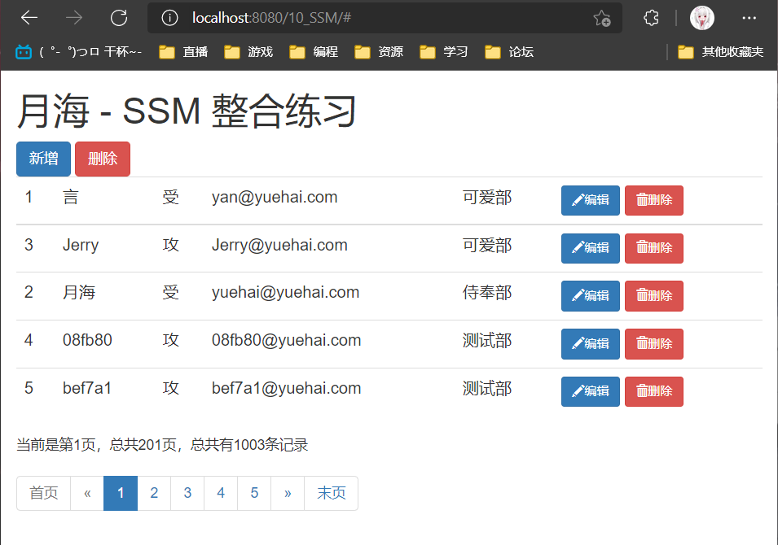

## 1、查询逻辑
1. 访问 index.jsp 页面
2. index.jsp 页面发送出查询员工列表请求
3. EmployeeController 来接受请求，查出员工数据
4. 来到 list.jsp 页面进行展示
5. pageHelper 分页插件完成分页查询功能
6. URI：/getEmps，请求方式：get
---
1. 引入一个新的依赖，jsp 的依赖
```xml
    <!-- jsp 依赖 -->
    <dependency>
        <groupId>javax.servlet.jsp</groupId>
        <artifactId>jsp-api</artifactId>
        <version>2.2</version>
    </dependency>
```
2. EmployeeService
```java
    public interface EmployeeService {

        /**
        * 查询所有员工数据（分页查询）
        * @return
        */
        public List<Employee> getAll();
    }
```
3. EmployeeServiceImpl
```java
    // 表明此为 Service 层
    @Service
    public class EmployeeServiceImpl implements EmployeeService {

        // 自动注入，根据类型注入
        @Autowired
        private EmployeeMapper employeeMapper;

        @Override
        public List<Employee> getAll() {
            // 按照条件查询，联合查询部门表
            return employeeMapper.selectByExampleWithDept(null);
        }
    }
```
4. EmployeeController
```java
    /**
    * 使用 Spring 测试模块提供的测试请求功能，测试 curd 请求的正确性
    * Spring4 测试的时候，需要servlet3.0的支持
    */
    @RunWith(SpringJUnit4ClassRunner.class)
    // 有此注解就可以使用 wbe ioc 容器：WebApplicationContext
    @WebAppConfiguration
    @ContextConfiguration(locations = {"classpath:applicationContext.xml","classpath:springMVC.xml"})
    public class MvcTest {

        // 传入Springmvc的ioc
        @Autowired
        WebApplicationContext context;
        // 虚拟 mvc 请求，获取处理结果。
        MockMvc mockMvc;
        // 创建 MockMvc
        @Before
        public void initMokcMvc() {
            mockMvc = MockMvcBuilders.webAppContextSetup(context).build();
        }

        @Test
        public void testPage() throws Exception {
            /**
            * 模拟请求拿到返回值
            * get("/getEmps")：模拟 get 请求，请求路径为 /emps
            * param("pn", "1")：请求参数，参数1为名，参数2为值
            * andReturn()：拿到请求的返回值
            */
            MvcResult result = mockMvc.perform(MockMvcRequestBuilders.get("/getEmps").param("pn", "1")).andReturn();

            // 请求成功以后，请求域中会有 pageInfo，我们可以取出 pageInfo 进行验证
            MockHttpServletRequest request = result.getRequest();
            PageInfo pi = (PageInfo) request.getAttribute("pageInfo");
            System.out.println("当前页码："+pi.getPageNum());
            System.out.println("总页码："+pi.getPages());
            System.out.println("总记录数："+pi.getTotal());
            System.out.println("在页面需要连续显示的页码");
            int[] nums = pi.getNavigatepageNums();
            for (int i : nums) {
                System.out.print(" "+i);
            }
            System.out.println();

            //获取员工数据
            List<Employee> list = pi.getList();
            for (Employee employee : list) {
                System.out.println("ID："+employee.getEmpId()+"==>Name:"+employee.getEmpName());
            }

        }
    }
```
5. MvcTest：测试业务，模拟请求与结果
```java
    /**
    * 使用 Spring 测试模块提供的测试请求功能，测试 curd 请求的正确性
    * Spring4 测试的时候，需要servlet3.0的支持
    */
    @RunWith(SpringJUnit4ClassRunner.class)
    // 有此注解就可以使用 wbe ioc 容器：WebApplicationContext
    @WebAppConfiguration
    @ContextConfiguration(locations = {"classpath:applicationContext.xml","classpath:springMVC.xml"})
    public class MvcTest {

        // 传入Springmvc的ioc
        @Autowired
        WebApplicationContext context;
        // 虚拟 mvc 请求，获取处理结果。
        MockMvc mockMvc;
        // 创建 MockMvc
        @Before
        public void initMokcMvc() {
            mockMvc = MockMvcBuilders.webAppContextSetup(context).build();
        }

        @Test
        public void testPage() throws Exception {
            /**
            * 模拟请求拿到返回值
            * get("/getEmps")：模拟 get 请求，请求路径为 /emps
            * param("pn", "1")：请求参数，参数1为名，参数2为值
            * andReturn()：拿到请求的返回值
            */
            MvcResult result = mockMvc.perform(MockMvcRequestBuilders.get("/getEmps").param("pn", "1")).andReturn();

            // 请求成功以后，请求域中会有 pageInfo，我们可以取出 pageInfo 进行验证
            MockHttpServletRequest request = result.getRequest();
            PageInfo pi = (PageInfo) request.getAttribute("pageInfo");
            System.out.println("当前页码："+pi.getPageNum());
            System.out.println("总页码："+pi.getPages());
            System.out.println("总记录数："+pi.getTotal());
            System.out.println("在页面需要连续显示的页码");
            int[] nums = pi.getNavigatepageNums();
            for (int i : nums) {
                System.out.print(" "+i);
            }
            System.out.println();

            //获取员工数据
            List<Employee> list = pi.getList();
            for (Employee employee : list) {
                System.out.println("ID："+employee.getEmpId()+"==>Name:"+employee.getEmpName());
            }

        }
    }
```
6. index.jsp
```js
    <%@ page contentType="text/html;charset=UTF-8" language="java" %>

    <%-- 使工程进入 indx.jsp 时跳转到员工列表页面 --%>
    <jsp:forward page="/getEmps"></jsp:forward>
```
7. list.jsp 员工列表
```html
    <%@ taglib prefix="c" uri="http://java.sun.com/jsp/jstl/core" %>
    <%@ page contentType="text/html;charset=UTF-8" language="java" %>
    <html>
    <head>
        <meta charset="utf-8">
        <meta http-equiv="X-UA-Compatible" content="IE=edge">
        <meta name="viewport" content="width=device-width, initial-scale=1">
        <!-- 上述3个meta标签*必须*放在最前面，任何其他内容都*必须*跟随其后！ -->

        <title>员工列表</title>

        <!-- Bootstrap 引入在线的 css 样式 -->
        <link rel="stylesheet" href="https://stackpath.bootstrapcdn.com/bootstrap/3.4.1/css/bootstrap.min.css"
            integrity="sha384-HSMxcRTRxnN+Bdg0JdbxYKrThecOKuH5zCYotlSAcp1+c8xmyTe9GYg1l9a69psu"
            crossorigin="anonymous">

        <!-- Bootstrap 引入在线的 jQuery 和 Bootstrap 的所有 JavaScript 插件 -->
        <!-- jQuery (Bootstrap 的所有 JavaScript 插件都依赖 jQuery，所以必须放在前边) -->
        <script src="https://fastly.jsdelivr.net/npm/jquery@1.12.4/dist/jquery.min.js"
                integrity="sha384-nvAa0+6Qg9clwYCGGPpDQLVpLNn0fRaROjHqs13t4Ggj3Ez50XnGQqc/r8MhnRDZ"
                crossorigin="anonymous">
        </script>
        <!-- 加载 Bootstrap 的所有 JavaScript 插件。你也可以根据需要只加载单个插件。 -->
        <script src="https://stackpath.bootstrapcdn.com/bootstrap/3.4.1/js/bootstrap.min.js"
                integrity="sha384-aJ21OjlMXNL5UyIl/XNwTMqvzeRMZH2w8c5cRVpzpU8Y5bApTppSuUkhZXN0VxHd"
                crossorigin="anonymous">
        </script>

        <%-- 获取当前站点的根路径，赋值给 APP_PATH --%>
        <%
            pageContext.setAttribute("APP_PATH", request.getContextPath());
        %>

    </head>
    <body>

    <!-- 搭建显示页面 -->
    <div class="container">

        <!-- 标题 -->
        <div class="row">
            <div class="col-md-12">
                <h1>月海 - SSM 整合练习</h1>
            </div>
        </div>

        <!-- 按钮 -->
        <div class="row">
            <div class="col-md-4 col-md-offset-8">
                <button class="btn btn-primary">新增</button>
                <button class="btn btn-danger">删除</button>
            </div>
        </div>

        <!-- 显示表格数据 -->
        <div class="row">
            <div class="col-md-12">
                <table class="table table-hover">
                    <tr>
                        <th>id</th>
                        <th>员工姓名</th>
                        <th>员工性别</th>
                        <th>员工邮箱</th>
                        <th>所在部门</th>
                        <th>操作</th>
                    </tr>
                    <!-- items：要遍历的数据；var：每次遍历赋值给的属性 -->
                    <!-- pageInfo.list：保存的员工数据 -->
                    <c:forEach items="${pageInfo.list }" var="emp">
                        <tr>
                            <th>${emp.empId }</th>
                            <th>${emp.empName }</th>
                            <!-- 三元运算 -->
                            <th>${emp.gender=="M"?"男":"女" }</th>
                            <th>${emp.email }</th>
                            <th>${emp.department.deptName }</th>
                            <th>
                                <button class="btn btn-primary btn-sm">
                                    <span class="glyphicon glyphicon-pencil" aria-hidden="true"></span>
                                    编辑
                                </button>
                                <button class="btn btn-danger btn-sm">
                                    <span class="glyphicon glyphicon-trash" aria-hidden="true"></span>
                                    删除
                                </button>
                            </th>
                        </tr>
                    </c:forEach>
                </table>
            </div>
        </div>

        <!-- 显示分页信息 -->
        <div class="row">
            <!--分页文字信息  -->
            <div class="col-md-6">当前 ${pageInfo.pageNum }页,总${pageInfo.pages }
                页,总 ${pageInfo.total } 条记录
            </div>

            <!-- 分页条信息 -->
            <div class="col-md-6">
                <nav aria-label="Page navigation">
                    <ul class="pagination">
                        <li><a href="${APP_PATH }/getEmps?pn=1">首页</a></li>

                        <!-- 判断当前页是否有前页，有则前一页按钮可点击 -->
                        <c:if test="${pageInfo.hasPreviousPage }">
                            <li>
                                <a href="${APP_PATH }/getEmps?pn=${pageInfo.pageNum-1}" aria-label="Previous">
                                    <span aria-hidden="true">&laquo;</span>
                                </a>
                            </li>
                        </c:if>
                        <!-- 判断当前页是否有前页，没有则前一页按钮不可点击 -->
                        <c:if test="${!pageInfo.hasPreviousPage }">
                            <li><a href="#" class="btn disabled" role="button">&laquo;</a></li>
                        </c:if>

                        <!-- 遍历连续显示的页码，是个数组 -->
                        <c:forEach items="${pageInfo.navigatepageNums }" var="page_Num">
                            <!-- 若本次遍历的页码是当前页码，则按钮不可点击，且按钮高亮 -->
                            <c:if test="${page_Num == pageInfo.pageNum }">
                                <li class="active"><a href="#">${page_Num }</a></li>
                            </c:if>
                            <!-- 若本次遍历的页码不是当前页码，则按钮可点击 -->
                            <c:if test="${page_Num != pageInfo.pageNum }">
                                <li><a href="${APP_PATH }/getEmps?pn=${page_Num }">${page_Num }</a></li>
                            </c:if>
                        </c:forEach>

                        <!-- 判断当前页是否有后页，有则后一页按钮可点击 -->
                        <c:if test="${pageInfo.hasNextPage }">
                            <li>
                                <a href="${APP_PATH }/getEmps?pn=${pageInfo.pageNum+1 }" aria-label="Next">
                                    <span aria-hidden="true">&raquo;</span>
                                </a>
                            </li>
                        </c:if>
                        <!-- 判断当前页是否有前页，没有则后一页按钮不可点击 -->
                        <c:if test="${!pageInfo.hasNextPage }">
                            <li><a href="#" class="btn disabled" role="button">&raquo;</a></li>
                        </c:if>

                        <li><a href="${APP_PATH }/getEmps?pn=${pageInfo.pages}">末页</a></li>

                    </ul>
                </nav>
            </div>
        </div>

    </div>

    </body>

    </html>
```


## 2、查询-ajax
1. index.jsp 页面直接发送 ajax 请求进行员工分页数据的查询
2. 服务器将查出的数据，以 json 字符串的形式返回给浏览器
3. 浏览器收到 js 字符串。可以使用 js 对 json 进行解析，使用 js 通过 dom 增删改改变页面。
4. 返回 json。实现客户端的无关性
---
- 第一页的具体的 json 字符串
```java
    {"code":100,"msg":"处理成功！","extend":
        {"pageInfo":
            {
                "pageNum":1,
                "pageSize":5,
                "size":5,
                "startRow":1,
                "endRow":5,
                "total":1003,
                "pages":201,
                "list":
                    [
                        {"empId":1,"empName":"言","gender":"0","email":"yan@yuehai.com","dId":1,"department":{"deptId":1,"deptName":"可爱部"}},
                        {"empId":3,"empName":"Jerry","gender":"M","email":"Jerry@yuehai.com","dId":1,"department":{"deptId":1,"deptName":"可爱部"}},
                        {"empId":2,"empName":"月海","gender":"0","email":"yuehai@yuehai.com","dId":2,"department":{"deptId":2,"deptName":"侍奉部"}},
                        {"empId":4,"empName":"08fb80","gender":"M","email":"08fb80@yuehai.com","dId":4,"department":{"deptId":4,"deptName":"测试部"}},
                        {"empId":5,"empName":"bef7a1","gender":"M","email":"bef7a1@yuehai.com","dId":4,"department":{"deptId":4,"deptName":"测试部"}}
                    ],
                "prePage":0,
                "nextPage":2,
                "isFirstPage":true,
                "isLastPage":false,
                "hasPreviousPage":false,
                "hasNextPage":true,
                "navigatePages":5,
                "navigatepageNums":[1,2,3,4,5],
                "navigateFirstPage":1,
                "navigateLastPage":5,
                "lastPage":5,
                "firstPage":1
            }
        }
    }
```
1. 创建状态码 Msg 的实体类
```java
    // 状态码
    public class Msg {
        //状态码   100-成功    200-失败
        private int code;
        //提示信息
        private String msg;

        //用户要返回给浏览器的数据
        private Map<String, Object> extend = new HashMap<String, Object>();

        // 定义静态构造器，处理成功返回的数据
        public static Msg success(){
            Msg result = new Msg();
            result.setCode(100);
            result.setMsg("处理成功！");
            return result;
        }
        // 定义静态构造器，处理失败返回的数据
        public static Msg fail(){
            Msg result = new Msg();
            result.setCode(200);
            result.setMsg("处理失败！");
            return result;
        }
        // 定义一个可以链式操作的方法（返回值还是这个类）
        public Msg add(String key,Object value){
            this.getExtend().put(key, value);
            return this;
        }

        public int getCode() { return code; }
        public void setCode(int code) { this.code = code; }
        public String getMsg() { return msg; }
        public void setMsg(String msg) { this.msg = msg; }
        public Map<String, Object> getExtend() { return extend; }
        public void setExtend(Map<String, Object> extend) { this.extend = extend; }

    }
```
2. EmployeeController 中 注释掉原先的 getEmps 方法，编写新的 getEmps2 方法，使用 json 和 Ajax
```java
    // 需导入 jackson 依赖，用于处理 json
    // 查询所有员工数据（分页查询，使用 json 和 Ajax）
    @RequestMapping("/getEmps2")
    // @ResponseBody用于标识一个控制器方法，
    // 可以将该方法的返回值直接作为响应报文的响应体响应到浏览器
    @ResponseBody
    // 将传入的要跳转到的页码数赋值给 pn，若是没有传入则默认值为 1
    public Msg getEmpsWithJson(@RequestParam(value = "pn",defaultValue = "1") Integer pn){
        // 1、在 MyBatis 配置文件中引入分页插件

        // 2、在查询之前调用分页方法即可实现分页
        // 参数1：页码数（第几页）；参数2：每页的数据数
        PageHelper.startPage(pn,5);

        // 3、查询语句（此时的查询即为查询语句）
        List<Employee> emps = employeeService.getAll();

        // 4、用 PageInfo 对查询结果进行包装
        // 参数1：查询出来的数据
        // 参数2：设置的 Navigatepage 的参数，连续显示的页数
        //      比如当前是第5页，则显示：34567
        //      比如当前是第7页，则显示：56789
        PageInfo page = new PageInfo(emps,5);

        // 返回处理成功（状态码100），并将分页数据一起返回
        return Msg.success().add("pageInfo",page);
    }
```
2. 创建 list2.jsp 页面，修改为使用 json 和 Ajax 实时更新页面，使其响应更迅速，前后端比较分离，适应更多的平台，原先的 list.jsp 不再使用
```html
    <%@ page contentType="text/html;charset=UTF-8" language="java" %>
    <html>
    <head>
        <meta charset="utf-8">
        <meta http-equiv="X-UA-Compatible" content="IE=edge">
        <meta name="viewport" content="width=device-width, initial-scale=1">
        <!-- 上述3个meta标签*必须*放在最前面，任何其他内容都*必须*跟随其后！ -->

        <title>员工列表 Plus</title>

        <!-- Bootstrap 引入在线的 css 样式 -->
        <link rel="stylesheet" href="https://stackpath.bootstrapcdn.com/bootstrap/3.4.1/css/bootstrap.min.css"
            integrity="sha384-HSMxcRTRxnN+Bdg0JdbxYKrThecOKuH5zCYotlSAcp1+c8xmyTe9GYg1l9a69psu"
            crossorigin="anonymous">

        <!-- Bootstrap 引入在线的 jQuery 和 Bootstrap 的所有 JavaScript 插件 -->
        <!-- jQuery (Bootstrap 的所有 JavaScript 插件都依赖 jQuery，所以必须放在前边) -->
        <script src="https://fastly.jsdelivr.net/npm/jquery@1.12.4/dist/jquery.min.js"
                integrity="sha384-nvAa0+6Qg9clwYCGGPpDQLVpLNn0fRaROjHqs13t4Ggj3Ez50XnGQqc/r8MhnRDZ"
                crossorigin="anonymous">
        </script>
        <!-- 加载 Bootstrap 的所有 JavaScript 插件。你也可以根据需要只加载单个插件。 -->
        <script src="https://stackpath.bootstrapcdn.com/bootstrap/3.4.1/js/bootstrap.min.js"
                integrity="sha384-aJ21OjlMXNL5UyIl/XNwTMqvzeRMZH2w8c5cRVpzpU8Y5bApTppSuUkhZXN0VxHd"
                crossorigin="anonymous">
        </script>

        <%-- 获取当前站点的根路径，赋值给 APP_PATH --%>
        <%
            pageContext.setAttribute("APP_PATH", request.getContextPath());
        %>

        <%-- 页面跳转，查询数据，解析 json，调用 Ajax --%>
        <script type="text/javascript">
            // 页面加载完成以后，调用页面跳转方法，解析数据
            $(function () {
                // 调用跳转方法，跳到第一页
                to_page(1);
            });

            // 抽取 Ajax 页面跳转及解析 json 数据的方法，便于调用
            // 参数 pn 为要跳转到的页码数
            function to_page(pn) {
                $.ajax({
                    // 请求地址为：工程路径/getEmps2
                    url: "${APP_PATH}/getEmps2",
                    // 请求参数
                    data: "pn=" + pn,
                    // 请求方式
                    type: "GET",
                    // result：服务器返回的数据
                    success: function (result) {
                        // 1、解析并显示员工数据
                        build_emps_table(result);
                        // 2、解析并显示分页信息
                        build_page_info(result);
                        // 3、解析显示分页条数据
                        build_page_nav(result);
                    }
                });
            }

            // 1、解析并显示员工数据
            function build_emps_table(result) {
                //清空员工数据表格，否则本次数据会与上一次的数据叠加，导致页面混乱
                $("#emps_table tbody").empty();

                // 分页数据都在 extend 对象中的 pageInfo 对象中的 list 数组中
                var emps = result.extend.pageInfo.list;
                // 遍历 list 员工数据，参数1：要遍历的数据，参数2：回调函数
                // 回调函数参数1：索引；参数2：当前遍历的数据对象
                $.each(emps, function (index, item) {
                    // 添加 td 标签，并将员工 id 放入其中
                    var empIdTd = $("<td></td>").append(item.empId);
                    // 添加 td 标签，并将员工姓名放入其中
                    var empNameTd = $("<td></td>").append(item.empName);
                    // 添加 td 标签，并将员工性别放入其中，以三元运算符改变参数
                    var genderTd = $("<td></td>").append(item.gender == '0' ? '受' : '攻');
                    // 添加 td 标签，并将员工邮箱放入其中
                    var emailTd = $("<td></td>").append(item.email);
                    // 添加 td 标签，并将员工部门放入其中
                    var deptNameTd = $("<td></td>").append(item.department.deptName);

                    // 编辑按钮，先添加 button 标签，再添加其 class 属性，然后添加 span 标签，再添加其 class 属性
                    // 最后在 span 标签中加入【编辑】文字
                    var editBtn = $("<button></button>").addClass("btn btn-primary btn-sm edit_btn")
                        .append($("<span></span>").addClass("glyphicon glyphicon-pencil")).append("编辑");
                    //为编辑按钮添加一个自定义的属性，来表示当前员工id
                    editBtn.attr("edit-id", item.empId);
                    // 删除按钮
                    var delBtn = $("<button></button>").addClass("btn btn-danger btn-sm delete_btn")
                        .append($("<span></span>").addClass("glyphicon glyphicon-trash")).append("删除");
                    //为删除按钮添加一个自定义的属性来表示当前删除的员工id
                    delBtn.attr("del-id", item.empId);

                    // 将编辑按钮与删除按钮添加到 td 标签中，两个按钮
                    var btnTd = $("<td></td>").append(editBtn).append(" ").append(delBtn);

                    // 将上面这些对象都添加到 id 为 emps_table 的标签的 tbody 标签的 tr 标签中
                    $("<tr></tr>").append(empIdTd)
                        .append(empNameTd)
                        .append(genderTd)
                        .append(emailTd)
                        .append(deptNameTd)
                        .append(btnTd)
                        // 选择 id 为 emps_table 的标签的 tbody 标签中
                        .appendTo("#emps_table tbody");
                });
            }

            // 2、解析并显示分页文字信息，当前是第几页、总记录数等
            function build_page_info(result) {
                //清空分页文字信息，否则本次数据会与上一次的数据叠加，导致页面混乱
                $("#page_info_area").empty();

                // 创建分页文字信息，将其添加到 id 为 page_info_area 的标签中
                $("#page_info_area").append("当前是第" + result.extend.pageInfo.pageNum + "页，总共" +
                    result.extend.pageInfo.pages + "页，总共有" +
                    result.extend.pageInfo.total + "条记录");
                // totalRecord = result.extend.pageInfo.total;
                // currentPage = result.extend.pageInfo.pageNum;
            }

            // 3、解析显示分页条数据
            function build_page_nav(result) {
                //清空分页条数据，否则本次数据会与上一次的数据叠加，导致页面混乱
                $("#page_nav_area").empty();

                // 创建下面这些 li 元素的父元素 ul
                var ul = $("<ul></ul>").addClass("pagination");

                // 首页，添加 li 标签，在其中添加 a 标签并在其中添加【首页】，并设置a 标签的 href 属性
                var firstPageLi = $("<li></li>").append($("<a></a>").append("首页").attr("href", "#"));
                // 上一页
                var prePageLi = $("<li></li>").append($("<a></a>").append("&laquo;"));
                // 判断当前页是否有前页（是否是第一页）
                if (result.extend.pageInfo.hasPreviousPage == false) {
                    // 是的话给 首页 和 上一页 添加 class 样式：disabled，使其不可点击
                    firstPageLi.addClass("disabled");
                    prePageLi.addClass("disabled");
                } else {
                    // 不是的话为元素添加点击翻页的事件
                    firstPageLi.click(function () {
                        // 跳转到第一页
                        to_page(1);
                    });
                    prePageLi.click(function () {
                        // 跳转到当前页的下一页
                        to_page(result.extend.pageInfo.pageNum - 1);
                    });
                }
                // 将 首页 和 上一页 添加到 ul 标签中
                ul.append(firstPageLi).append(prePageLi);

                // 使用遍历给 ul 标签中添加页码提示，1、2、3、4、5 数字导航分页条
                // 回调函数参数1：索引；参数2：当前遍历的数据对象
                $.each(result.extend.pageInfo.navigatepageNums, function (index, item) {
                    // 将 a 标签添加到 li 标签中，并在其中加入本次遍历出来的数据
                    var numLi = $("<li></li>").append($("<a></a>").append(item));
                    // 判断本次遍历出来的数据和本页的页码数是否相同
                    if (result.extend.pageInfo.pageNum == item) {
                        // 相同则添加 class 样式：active，使其高亮
                        numLi.addClass("active");
                    }
                    // 添加点击事件
                    numLi.click(function () {
                        to_page(item);
                    });
                    // 在 ul 标签中添加本次循环的 li 标签
                    ul.append(numLi);
                });

                // 下一页
                var nextPageLi = $("<li></li>").append($("<a></a>").append("&raquo;"));
                // 末页
                var lastPageLi = $("<li></li>").append($("<a></a>").append("末页").attr("href", "#"));
                // 判断当前页是否有下页（是否是最后一页）
                if (result.extend.pageInfo.hasNextPage == false) {
                    // 是的话给 末页 和 下一页 添加 class 样式：disabled，使其不可点击
                    nextPageLi.addClass("disabled");
                    lastPageLi.addClass("disabled");
                } else {
                    // 不是的话为元素添加点击翻页的事件
                    nextPageLi.click(function () {
                        to_page(result.extend.pageInfo.pageNum + 1);
                    });
                    lastPageLi.click(function () {
                        // 跳转到最后一页
                        to_page(result.extend.pageInfo.pages);
                    });
                }
                // 将 下一页 和 末页 添加到 ul 标签中
                ul.append(nextPageLi).append(lastPageLi);

                // 将 ul 标签添加到 id 为 page_nav_area 的标签的 nav 标签中
                $("<nav></nav>").append(ul).appendTo("#page_nav_area");
            }

        </script>

    </head>
    <body>

    <!-- 搭建显示页面 -->
    <div class="container">

        <!-- 标题 -->
        <div class="row">
            <div class="col-md-12">
                <h1>月海 - SSM 整合练习</h1>
            </div>
        </div>

        <!-- 按钮 -->
        <div class="row">
            <div class="col-md-4 col-md-offset-8">
                <button class="btn btn-primary">新增</button>
                <button class="btn btn-danger">删除</button>
            </div>
        </div>

        <!-- 显示表格数据 -->
        <div class="row">
            <div class="col-md-12">
                <table class="table table-hover" id="emps_table">
                    <tr>
                        <th>id</th>
                        <th>员工姓名</th>
                        <th>员工性别</th>
                        <th>员工邮箱</th>
                        <th>所在部门</th>
                        <th>操作</th>
                    </tr>

                </table>
            </div>
        </div>

        <!-- 显示分页信息 -->
        <div class="row">
            <!--分页文字信息  -->
            <div class="col-md-6" id="page_info_area"></div>
            <!-- 分页条信息 -->
            <div class="col-md-6" id="page_nav_area"></div>
        </div>

    </div>

    </body>

    </html>
```
- 此处有个 bug，查出来的数据顺序不对，说是乱序倒也不是乱序，不知道咋回事，以后再看看吧

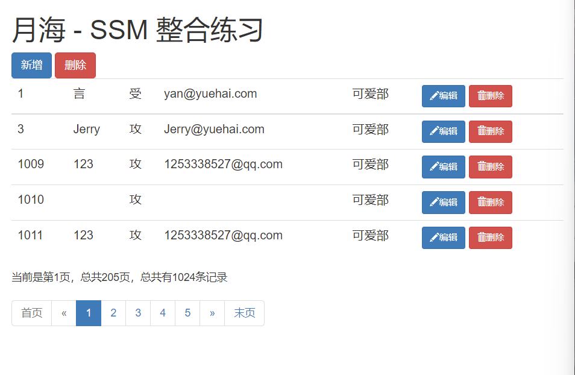


# 六、新增

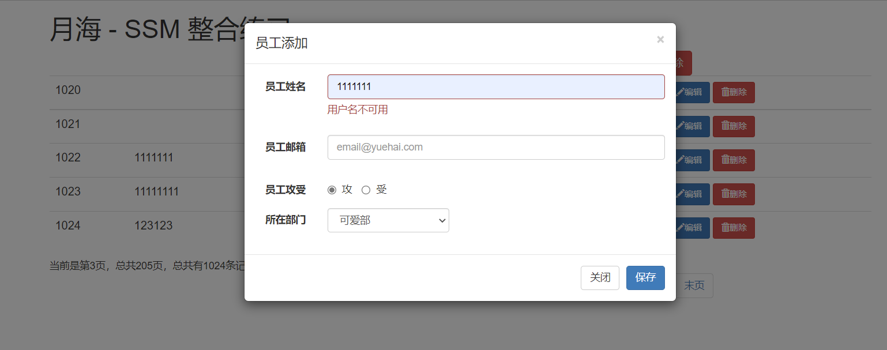

- 新增-逻辑
1. 在 list2.jsp 页面点击"新增"
2. 弹出新增对话框
3. 去数据库查询部门列表，显示在对话框中
4. 用户输入数据，并进行校验
   - jquery 前端校验，ajax 用户名重复校验，重要数据（后端校验(JSR303)，唯一约束）；
5. 完成保存
6. RESTful 风格的 URI：
   1. /emp/{id}，请求方式：GET，查询员工（之前的我不想改了）
   2. /emp，请求方式：POST，保存员工
   3. /emp/{id}，请求方式：PUT，修改员工
   4. /emp/{id}，DELETE，删除员工
---
1. 实体类 Employee 中添加注解校验
```java
    public class Employee {
        private Integer empId;

        // 自定义校验规则
        @Pattern(regexp = "(^[a-zA-Z0-9_-]{6,16}$)|(^[\\u2E80-\\u9FFF]{2,5})"
                // 出现错误后的提示消息
                ,message = "用户名必须是2-5位中文或者6-16位英文和数字的组合")
        private String empName;

        private String gender;

        // JSR303 校验的邮箱验证，也可以和上面一样用 @Pattern 自定义
        @Email
        private String email;

        private Integer dId;

        //希望查询员工的同时部门信息也是查询好的
        private Department department;

        // 生成构造器
        public Employee() { }
        public Employee(Integer empId, String empName, String gender, String email) {
            this.empId = empId;
            this.empName = empName;
            this.gender = gender;
            this.email = email;
        }
        public Employee(Integer empId, String empName, String gender, String email, Integer dId) {
            this.empId = empId;
            this.empName = empName;
            this.gender = gender;
            this.email = email;
            this.dId = dId;
        }
        public Employee(Integer empId, String empName, String gender, String email, Integer dId, Department department) {
            this.empId = empId;
            this.empName = empName;
            this.gender = gender;
            this.email = email;
            this.dId = dId;
            this.department = department;
        }

        public Integer getEmpId() {
            return empId;
        }

        public void setEmpId(Integer empId) {
            this.empId = empId;
        }

        public String getEmpName() {
            return empName;
        }

        public void setEmpName(String empName) {
            this.empName = empName == null ? null : empName.trim();
        }

        public String getGender() {
            return gender;
        }

        public void setGender(String gender) {
            this.gender = gender == null ? null : gender.trim();
        }

        public String getEmail() {
            return email;
        }

        public void setEmail(String email) {
            this.email = email == null ? null : email.trim();
        }

        public Integer getdId() {
            return dId;
        }

        public void setdId(Integer dId) {
            this.dId = dId;
        }

        // 添加 get set 方法
        public Department getDepartment() { return department; }
        public void setDepartment(Department department) { this.department = department; }

        @Override
        public String toString() {
            return "Employee{" +
                    "empId=" + empId +
                    ", empName='" + empName + '\'' +
                    ", gender='" + gender + '\'' +
                    ", email='" + email + '\'' +
                    ", dId=" + dId +
                    ", department=" + department +
                    '}';
        }
    }
```
2. EmployeeService
```java
        /**
        * 添加用户信息
        * @param employee
        */
        void addEmp(Employee employee);

        /**
        * 根据姓名查询员工
        * @return
        */
        boolean getEmpByName(String empName);
```
3. EmployeeServiceImpl
```java
    @Override
    public void addEmp(Employee employee) {
        // 有选择的插入，id 是自增的所以不插入
        employeeMapper.insertSelective(employee);
    }

    @Override
    public boolean getEmpByName(String empName) {
        // 创建 EmployeeExample 对象，此查询方法需要
        EmployeeExample employeeExample = new EmployeeExample();
        EmployeeExample.Criteria criteria = employeeExample.createCriteria();
        // 调用此方法拼装条件，使查询的员工姓名必须等于传进来的值

        criteria.andEmpNameEqualTo(empName);
        // 根据用户名查询数据库中是否有数据，有则返回大于 0 的数，没有则返回 0
        long count = employeeMapper.countByExample(employeeExample);

        // 返回布尔值，若数据库中有值则返回 true，没有值则返回 false
        return count == 0;
    }
```
4. DepartmentService
```java
    // 与部门有关的业务组件
    public interface DepartmentService {

        /**
        * 查询所有的部门信息
        * @return
        */
        public List<Department> getAll();
    }
```
5. DepartmentServiceImpl
```java
    // 表明此为 Service 层
    @Service
    public class DepartmentServiceImpl implements DepartmentService {

        // 自动注入，根据类型注入
        @Autowired
        DepartmentMapper departmentMapper;

        @Override
        public List<Department> getAll() {
            // 按照条件查询部门表，传入 null 则为查询全部
            return departmentMapper.selectByExample(null);
        }
    }
```
6. EmployeeController
```java
    // 处理和部门有关的请求
    // 表明此为控制层
    @Controller
    public class DepartmentController {

        // 自动注入，根据类型注入
        @Autowired
        DepartmentService departmentService;

        // 需导入 jackson 依赖，用于处理 json
        // 查询所有部门数据（使用 json 和 Ajax）
        @RequestMapping("/getDepts")
        // @ResponseBody用于标识一个控制器方法，
        // 可以将该方法的返回值直接作为响应报文的响应体响应到浏览器
        @ResponseBody
        public Msg getDepts(){
            // 调用查询所有部门的方法
            List<Department> depts = departmentService.getAll();

            // 返回处理成功（状态码100），并将查询到的数据一起返回
            return Msg.success().add("depts",depts);
        }
        
    }
```
7. DepartmentController
```java
    /**
     * 使用 Ajax 检验用户名是否可用
     * @param empName
     * @return
     */
    @RequestMapping("checkuser")
    // @ResponseBody用于标识一个控制器方法，
    // 可以将该方法的返回值直接作为响应报文的响应体响应到浏览器
    @ResponseBody
    // 将传入的员工姓名赋值给 empName
    public Msg checkuser(@RequestParam("empName") String empName){
        // 先判断当前输入的用户名是否是合法的表达式，以免与前端 js 的校验冲突
        // 定义正则表达式
        String regx = "(^[a-zA-Z0-9_-]{6,16}$)|(^[\\u2E80-\\u9FFF]{2,5})";
        // 判断传进来的用户名是否符合正则表达式的规则，返回 true 表示符合
        if(!empName.matches(regx)){
            // 返回处理失败（状态码200）
            return Msg.fail().add("va_msg","用户名必须是2-5位中文或者6-16位英文和数字的组合");
        }

        // 数据库中有值则返回 true，没有值则返回 false
        boolean empByName = employeeService.getEmpByName(empName);
        // 判断返回值
        if (empByName){
            // 返回处理成功（状态码100）
            return Msg.success();
        }else {
            // 返回处理失败（状态码200）
            return Msg.fail().add("va_msg","用户名不可用");
        }
    }

    /**
     * 添加用户信息，请求地址为：emp
     * RESTful 风格的 URI，请求方式为：POST
     * 	 1、支持 JSR303 校验
     * 	 2、导入 Hibernate-Validator
     * @return
     */
    @RequestMapping(value = "emp",method = RequestMethod.POST)
    // @ResponseBody用于标识一个控制器方法，
    // 可以将该方法的返回值直接作为响应报文的响应体响应到浏览器
    @ResponseBody
    // @Valid：表示后面跟的那个对象要进学校校验
    // BindingResult：封装的校验的结果
    public Msg addEmp(@Valid Employee employee, BindingResult result){
        // result.hasErrors()：校验失败（不通过）
        if(result.hasErrors()){
            // 校验失败，应该返回失败，在模态框中显示校验失败的错误信息
            // 创建一个 map 集合中，将错误的信息封装到其中
            Map<String,Object> map = new HashMap<>();
            // result.getFieldErrors()：返回所有字段的校验失败的错误信息
            List<FieldError> errors = result.getFieldErrors();
            // 遍历错误信息，将错误的信息封装到 map 集合中
            for(FieldError fieldError : errors){
                // fieldError.getField()：错误的字段名
                // fieldError.getDefaultMessage()：错误信息
                map.put(fieldError.getField(),fieldError.getDefaultMessage());
            }
            // 返回封装后的错误的信息
            return Msg.fail().add("errorFields",map);
        }else {
            // 校验成功则调用添加方法
            employeeService.addEmp(employee);

            // 返回处理成功（状态码100）
            return Msg.success();
        }
    }
```
8. list2.jsp
```html
    <%@ page contentType="text/html;charset=UTF-8" language="java" %>
    <html>
    <head>
        <meta charset="utf-8">
        <meta http-equiv="X-UA-Compatible" content="IE=edge">
        <meta name="viewport" content="width=device-width, initial-scale=1">
        <!-- 上述3个meta标签*必须*放在最前面，任何其他内容都*必须*跟随其后！ -->

        <title>员工列表 Plus</title>

        <!-- Bootstrap 引入在线的 css 样式 -->
        <link rel="stylesheet" href="https://stackpath.bootstrapcdn.com/bootstrap/3.4.1/css/bootstrap.min.css"
            integrity="sha384-HSMxcRTRxnN+Bdg0JdbxYKrThecOKuH5zCYotlSAcp1+c8xmyTe9GYg1l9a69psu"
            crossorigin="anonymous">

        <!-- Bootstrap 引入在线的 jQuery 和 Bootstrap 的所有 JavaScript 插件 -->
        <!-- jQuery (Bootstrap 的所有 JavaScript 插件都依赖 jQuery，所以必须放在前边) -->
        <script src="https://fastly.jsdelivr.net/npm/jquery@1.12.4/dist/jquery.min.js"
                integrity="sha384-nvAa0+6Qg9clwYCGGPpDQLVpLNn0fRaROjHqs13t4Ggj3Ez50XnGQqc/r8MhnRDZ"
                crossorigin="anonymous">
        </script>
        <!-- 加载 Bootstrap 的所有 JavaScript 插件。你也可以根据需要只加载单个插件。 -->
        <script src="https://stackpath.bootstrapcdn.com/bootstrap/3.4.1/js/bootstrap.min.js"
                integrity="sha384-aJ21OjlMXNL5UyIl/XNwTMqvzeRMZH2w8c5cRVpzpU8Y5bApTppSuUkhZXN0VxHd"
                crossorigin="anonymous">
        </script>

        <%-- 获取当前站点的根路径，赋值给 APP_PATH --%>
        <%
            pageContext.setAttribute("APP_PATH", request.getContextPath());
        %>

        <%-- 页面跳转，查询数据，解析 json，调用 Ajax --%>
        <script type="text/javascript">

            // 定义一个总记录数 和 当前页码数，方便之后的使用
            var totalRecord,currentPage;

            // 页面加载完成以后，调用页面跳转方法，解析数据
            $(function () {
                // 调用跳转方法，跳到第一页
                to_page(1);
            });

            // 抽取 Ajax 页面跳转及解析 json 数据的方法，便于调用
            // 参数 pn 为要跳转到的页码数
            function to_page(pn) {
                $.ajax({
                    // 请求地址为：工程路径/getEmps2
                    url: "${APP_PATH}/getEmps2",
                    // 请求参数
                    data: "pn=" + pn,
                    // 请求方式 GET
                    type: "GET",
                    // result：服务器返回的数据
                    success: function (result) {
                        // 1、解析并显示员工数据
                        build_emps_table(result);
                        // 2、解析并显示分页信息
                        build_page_info(result);
                        // 3、解析显示分页条数据
                        build_page_nav(result);
                    }
                });
            }

            // 1、解析并显示员工数据
            function build_emps_table(result) {
                //清空员工数据表格，否则本次数据会与上一次的数据叠加，导致页面混乱
                $("#emps_table tbody").empty();

                // 分页数据都在 extend 对象中的 pageInfo 对象中的 list 数组中
                var emps = result.extend.pageInfo.list;
                // 遍历 list 员工数据，参数1：要遍历的数据，参数2：回调函数
                // 回调函数参数1：索引；参数2：当前遍历的数据对象
                $.each(emps, function (index, item) {
                    // 添加 td 标签，并将员工 id 放入其中
                    var empIdTd = $("<td></td>").append(item.empId);
                    // 添加 td 标签，并将员工姓名放入其中
                    var empNameTd = $("<td></td>").append(item.empName);
                    // 添加 td 标签，并将员工性别放入其中，以三元运算符改变参数
                    var genderTd = $("<td></td>").append(item.gender == '0' ? '受' : '攻');
                    // 添加 td 标签，并将员工邮箱放入其中
                    var emailTd = $("<td></td>").append(item.email);
                    // 添加 td 标签，并将员工部门放入其中
                    var deptNameTd = $("<td></td>").append(item.department.deptName);

                    // 编辑按钮，先添加 button 标签，再添加其 class 属性，然后添加 span 标签，再添加其 class 属性
                    // 最后在 span 标签中加入【编辑】文字
                    var editBtn = $("<button></button>").addClass("btn btn-primary btn-sm edit_btn")
                        .append($("<span></span>").addClass("glyphicon glyphicon-pencil")).append("编辑");
                    //为编辑按钮添加一个自定义的属性，来表示当前员工id
                    editBtn.attr("edit-id", item.empId);
                    // 删除按钮
                    var delBtn = $("<button></button>").addClass("btn btn-danger btn-sm delete_btn")
                        .append($("<span></span>").addClass("glyphicon glyphicon-trash")).append("删除");
                    //为删除按钮添加一个自定义的属性来表示当前删除的员工id
                    delBtn.attr("del-id", item.empId);

                    // 将编辑按钮与删除按钮添加到 td 标签中，两个按钮
                    var btnTd = $("<td></td>").append(editBtn).append(" ").append(delBtn);

                    // 将上面这些对象都添加到 id 为 emps_table 的标签的 tbody 标签的 tr 标签中
                    $("<tr></tr>").append(empIdTd)
                        .append(empNameTd)
                        .append(genderTd)
                        .append(emailTd)
                        .append(deptNameTd)
                        .append(btnTd)
                        // 选择 id 为 emps_table 的标签的 tbody 标签中
                        .appendTo("#emps_table tbody");
                });
            }

            // 2、解析并显示分页文字信息，当前是第几页、总记录数等
            function build_page_info(result) {
                //清空分页文字信息，否则本次数据会与上一次的数据叠加，导致页面混乱
                $("#page_info_area").empty();

                // 创建分页文字信息，将其添加到 id 为 page_info_area 的标签中
                $("#page_info_area").append("当前是第" + result.extend.pageInfo.pageNum + "页，总共" +
                    result.extend.pageInfo.pages + "页，总共有" +
                    result.extend.pageInfo.total + "条记录");

                // 给定义的总记录数赋值，方便之后的操作
                totalRecord = result.extend.pageInfo.total;
                // 给定义的当前页码赋值，方便之后的操作
                currentPage = result.extend.pageInfo.pageNum;
            }

            // 3、解析显示分页条数据
            function build_page_nav(result) {
                //清空分页条数据，否则本次数据会与上一次的数据叠加，导致页面混乱
                $("#page_nav_area").empty();

                // 创建下面这些 li 元素的父元素 ul
                var ul = $("<ul></ul>").addClass("pagination");

                // 首页，添加 li 标签，在其中添加 a 标签并在其中添加【首页】，并设置a 标签的 href 属性
                var firstPageLi = $("<li></li>").append($("<a></a>").append("首页").attr("href", "#"));
                // 上一页
                var prePageLi = $("<li></li>").append($("<a></a>").append("&laquo;"));
                // 判断当前页是否有前页（是否是第一页）
                if (result.extend.pageInfo.hasPreviousPage == false) {
                    // 是的话给 首页 和 上一页 添加 class 样式：disabled，使其不可点击
                    firstPageLi.addClass("disabled");
                    prePageLi.addClass("disabled");
                } else {
                    // 不是的话为元素添加点击翻页的事件
                    firstPageLi.click(function () {
                        // 跳转到第一页
                        to_page(1);
                    });
                    prePageLi.click(function () {
                        // 跳转到当前页的下一页
                        to_page(result.extend.pageInfo.pageNum - 1);
                    });
                }
                // 将 首页 和 上一页 添加到 ul 标签中
                ul.append(firstPageLi).append(prePageLi);

                // 使用遍历给 ul 标签中添加页码提示，1、2、3、4、5 数字导航分页条
                // 回调函数参数1：索引；参数2：当前遍历的数据对象
                $.each(result.extend.pageInfo.navigatepageNums, function (index, item) {
                    // 将 a 标签添加到 li 标签中，并在其中加入本次遍历出来的数据
                    var numLi = $("<li></li>").append($("<a></a>").append(item));
                    // 判断本次遍历出来的数据和本页的页码数是否相同
                    if (result.extend.pageInfo.pageNum == item) {
                        // 相同则添加 class 样式：active，使其高亮
                        numLi.addClass("active");
                    }
                    // 添加点击事件
                    numLi.click(function () {
                        to_page(item);
                    });
                    // 在 ul 标签中添加本次循环的 li 标签
                    ul.append(numLi);
                });

                // 下一页
                var nextPageLi = $("<li></li>").append($("<a></a>").append("&raquo;"));
                // 末页
                var lastPageLi = $("<li></li>").append($("<a></a>").append("末页").attr("href", "#"));
                // 判断当前页是否有下页（是否是最后一页）
                if (result.extend.pageInfo.hasNextPage == false) {
                    // 是的话给 末页 和 下一页 添加 class 样式：disabled，使其不可点击
                    nextPageLi.addClass("disabled");
                    lastPageLi.addClass("disabled");
                } else {
                    // 不是的话为元素添加点击翻页的事件
                    nextPageLi.click(function () {
                        to_page(result.extend.pageInfo.pageNum + 1);
                    });
                    lastPageLi.click(function () {
                        // 跳转到最后一页
                        to_page(result.extend.pageInfo.pages);
                    });
                }
                // 将 下一页 和 末页 添加到 ul 标签中
                ul.append(nextPageLi).append(lastPageLi);

                // 将 ul 标签添加到 id 为 page_nav_area 的标签的 nav 标签中
                $("<nav></nav>").append(ul).appendTo("#page_nav_area");
            }

        </script>

    </head>
    <body>

    <!-- 员工添加的模态框，点击新增按钮调用 js 方法，使其弹出 -->
    <div class="modal fade" id="empAddModal" tabindex="-1" role="dialog" aria-labelledby="myModalLabel">
        <div class="modal-dialog" role="document">
            <div class="modal-content">
                <%-- 模态框最上方显示的 员工添加 文字 --%>
                <div class="modal-header">
                    <button type="button" class="close" data-dismiss="modal" aria-label="Close"><span aria-hidden="true">&times;</span>
                    </button>
                    <h4 class="modal-title" id="myModalLabel">员工添加</h4>
                </div>

                <div class="modal-body">
                    <%-- form 表单 --%>
                    <form class="form-horizontal">
                        <%-- 员工姓名 --%>
                        <div class="form-group">
                            <label class="col-sm-2 control-label">员工姓名</label>
                            <div class="col-sm-10">
                                <%-- 员工姓名输入框 --%>
                                <input type="text" name="empName" class="form-control" id="empName_add_input"
                                    placeholder="empName">
                                <span class="help-block"></span>
                            </div>
                        </div>
                        <%-- 员工邮箱 --%>
                        <div class="form-group">
                            <label class="col-sm-2 control-label">员工邮箱</label>
                            <div class="col-sm-10">
                                <%-- 员工邮箱输入框 --%>
                                <input type="text" name="email" class="form-control" id="email_add_input"
                                    placeholder="email@yuehai.com">
                                <span class="help-block"></span>
                            </div>
                        </div>
                        <%-- 员工攻受 --%>
                        <div class="form-group">
                            <label class="col-sm-2 control-label">员工攻受</label>
                            <div class="col-sm-10">
                                <%-- 员工攻受单选框 --%>
                                <label class="radio-inline">
                                    <input type="radio" name="gender" id="gender1_add_input" value="1" checked="checked"> 攻
                                </label>
                                <label class="radio-inline">
                                    <input type="radio" name="gender" id="gender2_add_input" value="0"> 受
                                </label>
                            </div>
                        </div>
                        <%-- 所在部门 --%>
                        <div class="form-group">
                            <label class="col-sm-2 control-label">所在部门</label>
                            <div class="col-sm-4">
                                <!-- 查出来的部门下拉单选框，部门提交部门id即可 -->
                                <select class="form-control" name="dId" id="dept_add_select"></select>
                            </div>
                        </div>
                    </form>
                </div>
                <!-- 部门提交部门id即可 -->
                <div class="modal-footer">
                    <button type="button" class="btn btn-default" data-dismiss="modal">关闭</button>
                    <button type="button" class="btn btn-primary" id="emp_save_btn">保存</button>
                </div>
            </div>
        </div>
    </div>

    <!-- 搭建显示页面 -->
    <div class="container">

        <!-- 标题 -->
        <div class="row">
            <div class="col-md-12">
                <h1>月海 - SSM 整合练习</h1>
            </div>
        </div>

        <!-- 按钮 -->
        <div class="row">
            <div class="col-md-4 col-md-offset-8">
                <button class="btn btn-primary" id="emp_add_modal_btn">新增</button>
                <button class="btn btn-danger" id="emp_delete_all_btn">删除</button>
            </div>
        </div>

        <!-- 显示表格数据 -->
        <div class="row">
            <div class="col-md-12">
                <table class="table table-hover" id="emps_table">
                    <tr>
                        <th>id</th>
                        <th>员工姓名</th>
                        <th>员工性别</th>
                        <th>员工邮箱</th>
                        <th>所在部门</th>
                        <th>操作</th>
                    </tr>

                </table>
            </div>
        </div>

        <!-- 显示分页信息 -->
        <div class="row">
            <!--分页文字信息  -->
            <div class="col-md-6" id="page_info_area"></div>
            <!-- 分页条信息 -->
            <div class="col-md-6" id="page_nav_area"></div>
        </div>

    </div>

    </body>

    <%-- 点击弹出模态框，进行增删改，此类 js 需放在页面内容的下方 --%>
    <script type="text/javascript">

        // 清空表单样式及内容，传入的参数为选择器
        function reset_form(ele){
            // 将 jq 对象转换为 js 对象以使用 reset() 方法，重置表单内容
            $(ele)[0].reset();
            // 清空传入的选择器中的所有的这两种表单样式
            $(ele).find("*").removeClass("has-error has-success");
            // 清空传入的选择器中 class 属性为 help-block 的文本内容
            $(ele).find(".help-block").text("");
        }

        // 点击新增按钮弹出员工添加的模态框
        $("#emp_add_modal_btn").click(function () {
            // 每次模态框弹出都清除表单数据，表单完整重置（表单的数据，表单的样式）
            // 调用 reset_form 方法清空数据
            reset_form("#empAddModal form");

            // 调用 getDepts 方法发送ajax请求，查出部门信息，
            // 将其显示在 id 为 dept_add_select （下拉列表）的标签中
            getDepts("#dept_add_select");

            // 调用 modal 方法弹出模态框
            $("#empAddModal").modal({
                // 打开模态框时点击背景不关闭模态框
                backdrop: "static"
            });
        });

        // 查出所有的部门信息并显示在下拉列表中方法
        function getDepts(ele){
            // 清空之前下拉列表的值
            $(ele).empty();

            // 发送 ajax 请求
            $.ajax({
                // 请求地址
                url:"${APP_PATH}/getDepts",
                // 请求方式 GET
                type:"GET",
                // 请求成功以后，处理返回的数据
                success:function(result){
                    // 遍历 depts 部门信息，参数1：要遍历的数据，参数2：回调函数
                    // 遍历的回调函数也可以不写参数，这样就用 this 表示本次遍历的对象
                    $.each(result.extend.depts,function(){
                        // 在 option 标签中加入本次遍历的 deptName，并添加属性 value 值为 本次遍历的 deptId
                        var optionEle = $("<option></option>").append(this.deptName).attr("value",this.deptId);
                        // 将本次遍历的数据添加到 id 为 ele（传入的参数）的标签中
                        optionEle.appendTo(ele);
                    });
                }
            });
        }

        // 显示校验结果的提示信息方法，传入 status 表示成功，其他为失败
        // 参数1：选择器名称；参数2：成功还是失败；参数3：提示的内容
        function show_validate_msg(ele,status,msg){
            // 清除当前元素的校验状态
            $(ele).parent().removeClass("has-success has-error");
            // 清除 span 标签中显示的文本内容
            $(ele).next("span").text("");

            // 判断成功还是失败
            if("success"==status){
                $(ele).parent().addClass("has-success");
                $(ele).next("span").text(msg);
            }else if("error" == status){
                $(ele).parent().addClass("has-error");
                $(ele).next("span").text(msg);
            }
        }

        // 点击确定按钮后校验表单数据方法
        function validate_add_form(){
            // 拿到要校验的数据，使用正则表达式
            // 1、校验员工姓名信息
            var empName = $("#empName_add_input").val();
            // 规则：6-16 位英文字母和数字或 2-5 位中文的组合
            var regName = /(^[a-zA-Z0-9_-]{6,16}$)|(^[\u2E80-\u9FFF]{2,5})/;
            // 判断是否满足规则
            if(!regName.test(empName)){
                // 不满足规则的提示，调用 show_validate_msg 方法
                show_validate_msg("#empName_add_input", "error", "用户名可以是2-5位中文或者6-16位英文和数字的组合");
                // 跳出方法
                return false;
            }else{
                // 满足规则的提示，调用 show_validate_msg 方法
                show_validate_msg("#empName_add_input", "success", "");
            };

            // 2、校验邮箱信息
            var email = $("#email_add_input").val();
            var regEmail = /^([a-z0-9_\.-]+)@([\da-z\.-]+)\.([a-z\.]{2,6})$/;
            // 判断是否满足规则
            if(!regEmail.test(email)){
                // 不满足规则的提示，调用 show_validate_msg 方法
                show_validate_msg("#email_add_input", "error", "邮箱格式不正确");
                // 跳出方法
                return false;
            }else{
                // 满足规则的提示，调用 show_validate_msg 方法
                show_validate_msg("#email_add_input", "success", "");
            }
            // 都没有错误，返回 true
            return true;
        }

        // 离开焦点事件，发送 ajax 请求校验用户名是否可用
        $("#empName_add_input").change(function(){
            // 获取当前标签中 value 属性的值
            var empName = this.value;

            // 发送 ajax 请求校验用户名是否可用
            $.ajax({
                // 请求地址
                url:"${APP_PATH}/checkuser",
                // 请求方式 GET
                type:"GET",
                // 请求的参数
                data:"empName=" + empName,
                // 请求成功以后，处理返回的数据
                success:function(result){
                    // 判断返回的状态码是否为 100
                    if(result.code==100){
                        // 是则说明数据库中没有此员工，可以添加
                        // 满足规则的提示，调用 show_validate_msg 方法
                        show_validate_msg("#empName_add_input","success","用户名可用");
                        // 给保存按钮一个自定义的属性，让我们可以知道校验用户名的结果
                        $("#emp_save_btn").attr("ajax-va","success");
                    }else{
                        // 不是则说明数据库中有此员工，不可以添加
                        // 不满足规则的提示，调用 show_validate_msg 方法
                        show_validate_msg("#empName_add_input","error",result.extend.va_msg);
                        // 给保存按钮一个自定义的属性，让我们可以知道校验用户名的结果
                        $("#emp_save_btn").attr("ajax-va","error");
                    }
                }
            });
        });

        // 点击保存按钮，添加员工
        $("#emp_save_btn").click(function(){
            // 一、模态框中填写的表单数据提交给服务器进行保存
            // 1、对提交给服务器的数据进行 js 校验，调用 validate_add_form 方法判断其返回值
            if(!validate_add_form()){
                // 返回值为 false 则跳出方法
                return false;
            };
            // 2、判断之前的，离开焦点事件，发送 ajax 请求校验用户名是否可用
            // 判断保存按钮的 ajax-va 属性的值是否为 error，之前设置的值
            if($(this).attr("ajax-va")=="error"){
                // 为 error 跳出方法
                return false;
            }

            // 二、发送ajax请求保存员工
            $.ajax({
                // 请求地址
                url:"${APP_PATH}/emp",
                // 请求方式 POST
                type:"POST",
                // 请求的参数：id 为 empAddModal 的标签中的 form 标签序列化之后的数据
                // serialize()：将表单中的数据序列化
                data:$("#empAddModal form").serialize(),
                // 请求成功以后，处理返回的数据
                success:function(result){
                    // 判断返回的状态码是否为 100
                    if(result.code == 100){
                        // 是则说明员工保存成功；
                        // 1、关闭模态框
                        $("#empAddModal").modal('hide');

                        // 2、调用最开始定义的总记录数，来到最后一页，
                        // 显示刚才保存的数据，发送 ajax 请求显示最后一页数据即可
                        to_page(totalRecord);
                    }
                    else{
                        // 不是则显示显示失败信息
                        // 有哪个字段的错误信息就显示哪个字段的；undefined：空
                        if(undefined != result.extend.errorFields.empName){
                            //显示员工名字的错误信息
                            show_validate_msg("#empName_add_input", "error", result.extend.errorFields.empName);
                        }
                        if(undefined != result.extend.errorFields.email){
                            //显示邮箱错误信息
                            show_validate_msg("#email_add_input", "error", result.extend.errorFields.email);
                        }
                    }
                }
            });
        });

    </script>

    </html>
```
- 最后还有一个小 bug：离开焦点事件的 Ajax 服务器端员工姓名校验返回校验失败后（正则表达式合法，但是数据库中已有同名员工），若是再点击保存，则会变为校验通过的样子，虽然并不能添加成功


# 七、修改

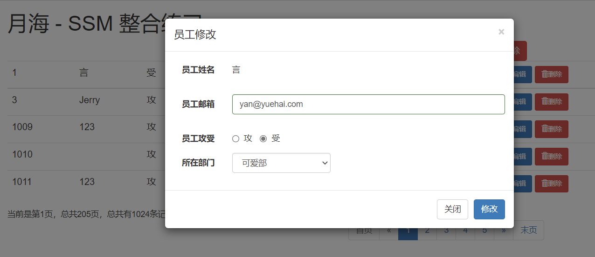

- 修改-逻辑
1. 点击编辑
2. 弹出用户修改的模态框（显示用户信息）
3. 点击更新，完成用户修改
---
1. 记得在 web.xml 中配置过滤器
```xml
    <!-- 4、使用Rest风格的URI，将页面普通的post请求转为指定的delete或者put请求 -->
    <filter>
        <filter-name>HiddenHttpMethodFilter</filter-name>
        <filter-class>org.springframework.web.filter.HiddenHttpMethodFilter</filter-class>
    </filter>
    <filter-mapping>
        <filter-name>HiddenHttpMethodFilter</filter-name>
        <url-pattern>/*</url-pattern>
    </filter-mapping>
    <filter>
        <filter-name>HttpPutFormContentFilter</filter-name>
        <filter-class>org.springframework.web.filter.HttpPutFormContentFilter</filter-class>
    </filter>
    <filter-mapping>
        <filter-name>HttpPutFormContentFilter</filter-name>
        <url-pattern>/*</url-pattern>
    </filter-mapping>
```
2. EmployeeService
```java
    /**
     * 根据 id 查询员工
     * @param id
     */
    Employee getEmp(Integer id);

    /**
     * 根据 id 修改员工
     * @param employee
     */
    void updateEmp(Employee employee);
```
3. EmployeeServiceImpl
```java
    @Override
    public Employee getEmp(Integer id) {
        // 根据主键查询
        return employeeMapper.selectByPrimaryKey(id);
    }

    @Override
    public void updateEmp(Employee employee) {
        // 根据主键进行有选择的更新
        employeeMapper.updateByPrimaryKeySelective(employee);
    }
```
4. EmployeeController
```java
    // RESTful 风格的 URI，请求方式为：GET，查询
    @RequestMapping(value = "emp/{id}",method = RequestMethod.GET)
    // @ResponseBody用于标识一个控制器方法，
    // 可以将该方法的返回值直接作为响应报文的响应体响应到浏览器
    @ResponseBody
    // 将传入的员工 id 赋值给 id
    public Msg getEmp(@PathVariable("id") Integer id){
        // 查询语句，根据 id 查询
        Employee employee = employeeService.getEmp(id);

        // 返回处理成功（状态码100），并将查询到的数据一起返回
        return Msg.success().add("emp",employee);
    }

    /**
     * 如果直接发送ajax=PUT形式的请求
     * 封装的数据无法封装
     * Employee
     * [empId=1014, empName=null, gender=null, email=null, dId=null]
     *
     * 问题：
     * 请求体中有数据；
     * 但是Employee对象封装不上；
     * update tbl_emp  where emp_id = 1014;
     *
     * 原因：
     * Tomcat：
     * 		1、将请求体中的数据，封装一个map。
     * 		2、request.getParameter("empName")就会从这个map中取值。
     * 		3、SpringMVC封装POJO对象的时候，会把POJO中每个属性的值，request.getParamter("email");
     *
     * AJAX发送PUT请求引发的血案：
     * 		PUT请求，请求体中的数据，request.getParameter("empName")拿不到
     * 		Tomcat一看是PUT不会封装请求体中的数据为map，只有POST形式的请求才封装请求体为map
     *
     * org.apache.catalina.connector.Request--parseParameters() (3111行)：
     *
     * protected String parseBodyMethods = "POST";
     * if( !getConnector().isParseBodyMethod(getMethod()) ) {
     *      success = true;
     *      return;
     * }
     *
     * 解决方案；
     *  我们要能支持直接发送PUT之类的请求还要封装请求体中的数据
     *  1、web.xml 配置上 HttpPutFormContentFilter；
     *  2、他的作用；将请求体中的数据解析包装成一个map。
     *  3、request被重新包装，request.getParameter()被重写，就会从自己封装的map中取数据
     */
    // RESTful 风格的 URI，请求方式为：PUT，修改
    // 这里的参数 empId 要和实体类中的属性名一致，才会自动封装进对象
    @RequestMapping(value = "emp/{empId}",method = RequestMethod.PUT)
    // @ResponseBody用于标识一个控制器方法，
    // 可以将该方法的返回值直接作为响应报文的响应体响应到浏览器
    @ResponseBody
    public Msg updateEmp(Employee employee){
        // 根据 id 修改员工
        employeeService.updateEmp(employee);

        // 返回处理成功（状态码100）
        return Msg.success();
    }
```
5. list2.jsp
```html
    <%@ page contentType="text/html;charset=UTF-8" language="java" %>
    <html>
    <head>
        <meta charset="utf-8">
        <meta http-equiv="X-UA-Compatible" content="IE=edge">
        <meta name="viewport" content="width=device-width, initial-scale=1">
        <!-- 上述3个meta标签*必须*放在最前面，任何其他内容都*必须*跟随其后！ -->

        <title>员工列表 Plus</title>

        <!-- Bootstrap 引入在线的 css 样式 -->
        <link rel="stylesheet" href="https://stackpath.bootstrapcdn.com/bootstrap/3.4.1/css/bootstrap.min.css"
            integrity="sha384-HSMxcRTRxnN+Bdg0JdbxYKrThecOKuH5zCYotlSAcp1+c8xmyTe9GYg1l9a69psu"
            crossorigin="anonymous">

        <!-- Bootstrap 引入在线的 jQuery 和 Bootstrap 的所有 JavaScript 插件 -->
        <!-- jQuery (Bootstrap 的所有 JavaScript 插件都依赖 jQuery，所以必须放在前边) -->
        <script src="https://fastly.jsdelivr.net/npm/jquery@1.12.4/dist/jquery.min.js"
                integrity="sha384-nvAa0+6Qg9clwYCGGPpDQLVpLNn0fRaROjHqs13t4Ggj3Ez50XnGQqc/r8MhnRDZ"
                crossorigin="anonymous">
        </script>
        <!-- 加载 Bootstrap 的所有 JavaScript 插件。你也可以根据需要只加载单个插件。 -->
        <script src="https://stackpath.bootstrapcdn.com/bootstrap/3.4.1/js/bootstrap.min.js"
                integrity="sha384-aJ21OjlMXNL5UyIl/XNwTMqvzeRMZH2w8c5cRVpzpU8Y5bApTppSuUkhZXN0VxHd"
                crossorigin="anonymous">
        </script>

        <%-- 获取当前站点的根路径，赋值给 APP_PATH --%>
        <%
            pageContext.setAttribute("APP_PATH", request.getContextPath());
        %>

        <%-- 页面跳转，查询数据，解析 json，调用 Ajax --%>
        <script type="text/javascript">

            // 定义一个总记录数 和 当前页码数，方便之后的使用
            var totalRecord,currentPage;

            // 页面加载完成以后，调用页面跳转方法，解析数据
            $(function () {
                // 调用跳转方法，跳到第一页
                to_page(1);
            });

            // 抽取 Ajax 页面跳转及解析 json 数据的方法，便于调用
            // 参数 pn 为要跳转到的页码数
            function to_page(pn) {
                $.ajax({
                    // 请求地址为：工程路径/getEmps2
                    url: "${APP_PATH}/getEmps2",
                    // 请求参数
                    data: "pn=" + pn,
                    // 请求方式 GET
                    type: "GET",
                    // result：服务器返回的数据
                    success: function (result) {
                        // 1、解析并显示员工数据
                        build_emps_table(result);
                        // 2、解析并显示分页信息
                        build_page_info(result);
                        // 3、解析显示分页条数据
                        build_page_nav(result);
                    }
                });
            }

            // 1、解析并显示员工数据
            function build_emps_table(result) {
                //清空员工数据表格，否则本次数据会与上一次的数据叠加，导致页面混乱
                $("#emps_table tbody").empty();

                // 分页数据都在 extend 对象中的 pageInfo 对象中的 list 数组中
                var emps = result.extend.pageInfo.list;
                // 遍历 list 员工数据，参数1：要遍历的数据，参数2：回调函数
                // 回调函数参数1：索引；参数2：当前遍历的数据对象
                $.each(emps, function (index, item) {
                    // 添加 td 标签，并将员工 id 放入其中
                    var empIdTd = $("<td></td>").append(item.empId);
                    // 添加 td 标签，并将员工姓名放入其中
                    var empNameTd = $("<td></td>").append(item.empName);
                    // 添加 td 标签，并将员工性别放入其中，以三元运算符改变参数
                    var genderTd = $("<td></td>").append(item.gender == '0' ? '受' : '攻');
                    // 添加 td 标签，并将员工邮箱放入其中
                    var emailTd = $("<td></td>").append(item.email);
                    // 添加 td 标签，并将员工部门放入其中
                    var deptNameTd = $("<td></td>").append(item.department.deptName);

                    // 编辑按钮，先添加 button 标签，再添加其 class 属性，然后添加 span 标签，再添加其 class 属性
                    // 最后在 span 标签中加入【编辑】文字
                    var editBtn = $("<button></button>").addClass("btn btn-primary btn-sm edit_btn")
                        .append($("<span></span>").addClass("glyphicon glyphicon-pencil")).append("编辑");
                    // 为编辑按钮添加一个自定义的属性，来表示当前员工id
                    editBtn.attr("edit-id", item.empId);

                    // 删除按钮
                    var delBtn = $("<button></button>").addClass("btn btn-danger btn-sm delete_btn")
                        .append($("<span></span>").addClass("glyphicon glyphicon-trash")).append("删除");
                    //为删除按钮添加一个自定义的属性来表示当前删除的员工id
                    delBtn.attr("del-id", item.empId);

                    // 将编辑按钮与删除按钮添加到 td 标签中，两个按钮
                    var btnTd = $("<td></td>").append(editBtn).append(" ").append(delBtn);

                    // 将上面这些对象都添加到 id 为 emps_table 的标签的 tbody 标签的 tr 标签中
                    $("<tr></tr>").append(empIdTd)
                        .append(empNameTd)
                        .append(genderTd)
                        .append(emailTd)
                        .append(deptNameTd)
                        .append(btnTd)
                        // 选择 id 为 emps_table 的标签的 tbody 标签中
                        .appendTo("#emps_table tbody");
                });
            }

            // 2、解析并显示分页文字信息，当前是第几页、总记录数等
            function build_page_info(result) {
                //清空分页文字信息，否则本次数据会与上一次的数据叠加，导致页面混乱
                $("#page_info_area").empty();

                // 创建分页文字信息，将其添加到 id 为 page_info_area 的标签中
                $("#page_info_area").append("当前是第" + result.extend.pageInfo.pageNum + "页，总共" +
                    result.extend.pageInfo.pages + "页，总共有" +
                    result.extend.pageInfo.total + "条记录");

                // 给定义的总记录数赋值，方便之后的操作
                totalRecord = result.extend.pageInfo.total;
                // 给定义的当前页码赋值，方便之后的操作
                currentPage = result.extend.pageInfo.pageNum;
            }

            // 3、解析显示分页条数据
            function build_page_nav(result) {
                //清空分页条数据，否则本次数据会与上一次的数据叠加，导致页面混乱
                $("#page_nav_area").empty();

                // 创建下面这些 li 元素的父元素 ul
                var ul = $("<ul></ul>").addClass("pagination");

                // 首页，添加 li 标签，在其中添加 a 标签并在其中添加【首页】，并设置a 标签的 href 属性
                var firstPageLi = $("<li></li>").append($("<a></a>").append("首页").attr("href", "#"));
                // 上一页
                var prePageLi = $("<li></li>").append($("<a></a>").append("&laquo;"));
                // 判断当前页是否有前页（是否是第一页）
                if (result.extend.pageInfo.hasPreviousPage == false) {
                    // 是的话给 首页 和 上一页 添加 class 样式：disabled，使其不可点击
                    firstPageLi.addClass("disabled");
                    prePageLi.addClass("disabled");
                } else {
                    // 不是的话为元素添加点击翻页的事件
                    firstPageLi.click(function () {
                        // 跳转到第一页
                        to_page(1);
                    });
                    prePageLi.click(function () {
                        // 跳转到当前页的下一页
                        to_page(result.extend.pageInfo.pageNum - 1);
                    });
                }
                // 将 首页 和 上一页 添加到 ul 标签中
                ul.append(firstPageLi).append(prePageLi);

                // 使用遍历给 ul 标签中添加页码提示，1、2、3、4、5 数字导航分页条
                // 回调函数参数1：索引；参数2：当前遍历的数据对象
                $.each(result.extend.pageInfo.navigatepageNums, function (index, item) {
                    // 将 a 标签添加到 li 标签中，并在其中加入本次遍历出来的数据
                    var numLi = $("<li></li>").append($("<a></a>").append(item));
                    // 判断本次遍历出来的数据和本页的页码数是否相同
                    if (result.extend.pageInfo.pageNum == item) {
                        // 相同则添加 class 样式：active，使其高亮
                        numLi.addClass("active");
                    }
                    // 添加点击事件
                    numLi.click(function () {
                        to_page(item);
                    });
                    // 在 ul 标签中添加本次循环的 li 标签
                    ul.append(numLi);
                });

                // 下一页
                var nextPageLi = $("<li></li>").append($("<a></a>").append("&raquo;"));
                // 末页
                var lastPageLi = $("<li></li>").append($("<a></a>").append("末页").attr("href", "#"));
                // 判断当前页是否有下页（是否是最后一页）
                if (result.extend.pageInfo.hasNextPage == false) {
                    // 是的话给 末页 和 下一页 添加 class 样式：disabled，使其不可点击
                    nextPageLi.addClass("disabled");
                    lastPageLi.addClass("disabled");
                } else {
                    // 不是的话为元素添加点击翻页的事件
                    nextPageLi.click(function () {
                        to_page(result.extend.pageInfo.pageNum + 1);
                    });
                    lastPageLi.click(function () {
                        // 跳转到最后一页
                        to_page(result.extend.pageInfo.pages);
                    });
                }
                // 将 下一页 和 末页 添加到 ul 标签中
                ul.append(nextPageLi).append(lastPageLi);

                // 将 ul 标签添加到 id 为 page_nav_area 的标签的 nav 标签中
                $("<nav></nav>").append(ul).appendTo("#page_nav_area");
            }

        </script>

    </head>
    <body>

    <!-- 员工添加的模态框，点击新增按钮调用 js 方法，使其弹出 -->
    <div class="modal fade" id="empAddModal" tabindex="-1" role="dialog" aria-labelledby="myModalLabel">
        <div class="modal-dialog" role="document">
            <div class="modal-content">
                <%-- 模态框最上方显示的 员工添加 文字 --%>
                <div class="modal-header">
                    <button type="button" class="close" data-dismiss="modal" aria-label="Close"><span aria-hidden="true">&times;</span>
                    </button>
                    <h4 class="modal-title" id="myModalLabel">员工添加</h4>
                </div>

                <div class="modal-body">
                    <%-- form 表单 --%>
                    <form class="form-horizontal">
                        <%-- 员工姓名 --%>
                        <div class="form-group">
                            <label class="col-sm-2 control-label">员工姓名</label>
                            <div class="col-sm-10">
                                <%-- 员工姓名输入框 --%>
                                <input type="text" name="empName" class="form-control" id="empName_add_input"
                                    placeholder="empName">
                                <span class="help-block"></span>
                            </div>
                        </div>
                        <%-- 员工邮箱 --%>
                        <div class="form-group">
                            <label class="col-sm-2 control-label">员工邮箱</label>
                            <div class="col-sm-10">
                                <%-- 员工邮箱输入框 --%>
                                <input type="text" name="email" class="form-control" id="email_add_input"
                                    placeholder="email@yuehai.com">
                                <span class="help-block"></span>
                            </div>
                        </div>
                        <%-- 员工攻受 --%>
                        <div class="form-group">
                            <label class="col-sm-2 control-label">员工攻受</label>
                            <div class="col-sm-10">
                                <%-- 员工攻受单选框 --%>
                                <label class="radio-inline">
                                    <input type="radio" name="gender" id="gender1_add_input" value="1" checked="checked"> 攻
                                </label>
                                <label class="radio-inline">
                                    <input type="radio" name="gender" id="gender2_add_input" value="0"> 受
                                </label>
                            </div>
                        </div>
                        <%-- 所在部门 --%>
                        <div class="form-group">
                            <label class="col-sm-2 control-label">所在部门</label>
                            <div class="col-sm-4">
                                <!-- 查出来的部门下拉单选框，部门提交部门id即可 -->
                                <select class="form-control" name="dId" id="dept_add_select"></select>
                            </div>
                        </div>
                    </form>
                </div>
                <!-- 部门提交部门id即可 -->
                <div class="modal-footer">
                    <button type="button" class="btn btn-default" data-dismiss="modal">关闭</button>
                    <button type="button" class="btn btn-primary" id="emp_save_btn">保存</button>
                </div>
            </div>
        </div>
    </div>

    <!-- 员工修改的模态框，点击编辑按钮调用 js 方法，使其弹出 -->
    <div class="modal fade" id="empUpdateModal" tabindex="-1" role="dialog" aria-labelledby="myModalLabel">
        <div class="modal-dialog" role="document">
            <div class="modal-content">
                <%-- 模态框最上方显示的 员工修改 文字 --%>
                <div class="modal-header">
                    <button type="button" class="close" data-dismiss="modal" aria-label="Close"><span aria-hidden="true">&times;</span>
                    </button>
                    <h4 class="modal-title">员工修改</h4>
                </div>

                <div class="modal-body">
                    <%-- form 表单 --%>
                    <form class="form-horizontal">
                        <%-- 员工姓名 --%>
                        <div class="form-group">
                            <label class="col-sm-2 control-label">员工姓名</label>
                            <div class="col-sm-10">
                                <%-- 员工姓名展示框，不可修改 --%>
                                <p class="form-control-static" id="empName_update_static"></p>
                                <span class="help-block"></span>
                            </div>
                        </div>
                        <%-- 员工邮箱 --%>
                        <div class="form-group">
                            <label class="col-sm-2 control-label">员工邮箱</label>
                            <div class="col-sm-10">
                                <%-- 员工邮箱输入框 --%>
                                <input type="text" name="email" class="form-control" id="email_update_input"
                                    placeholder="email@yuehai.com">
                                <span class="help-block"></span>
                            </div>
                        </div>
                        <%-- 员工攻受 --%>
                        <div class="form-group">
                            <label class="col-sm-2 control-label">员工攻受</label>
                            <div class="col-sm-10">
                                <%-- 员工攻受单选框 --%>
                                <label class="radio-inline">
                                    <input type="radio" name="gender" id="gender1_update_input" value="1" checked="checked"> 攻
                                </label>
                                <label class="radio-inline">
                                    <input type="radio" name="gender" id="gender2_update_input" value="0"> 受
                                </label>
                            </div>
                        </div>
                        <%-- 所在部门 --%>
                        <div class="form-group">
                            <label class="col-sm-2 control-label">所在部门</label>
                            <div class="col-sm-4">
                                <!-- 查出来的部门下拉单选框，部门提交部门id即可 -->
                                <select class="form-control" name="dId" id="dept_update_select"></select>
                            </div>
                        </div>
                    </form>
                </div>
                <!-- 部门提交部门id即可 -->
                <div class="modal-footer">
                    <button type="button" class="btn btn-default" data-dismiss="modal">关闭</button>
                    <button type="button" class="btn btn-primary" id="emp_update_btn">修改</button>
                </div>
            </div>
        </div>
    </div>

    <!-- 搭建显示页面 -->
    <div class="container">

        <!-- 标题 -->
        <div class="row">
            <div class="col-md-12">
                <h1>月海 - SSM 整合练习</h1>
            </div>
        </div>

        <!-- 按钮 -->
        <div class="row">
            <div class="col-md-4 col-md-offset-8">
                <button class="btn btn-primary" id="emp_add_modal_btn">新增</button>
                <button class="btn btn-danger" id="emp_delete_all_btn">删除</button>
            </div>
        </div>

        <!-- 显示表格数据 -->
        <div class="row">
            <div class="col-md-12">
                <table class="table table-hover" id="emps_table">
                    <tr>
                        <th>id</th>
                        <th>员工姓名</th>
                        <th>员工性别</th>
                        <th>员工邮箱</th>
                        <th>所在部门</th>
                        <th>操作</th>
                    </tr>

                </table>
            </div>
        </div>

        <!-- 显示分页信息 -->
        <div class="row">
            <!--分页文字信息  -->
            <div class="col-md-6" id="page_info_area"></div>
            <!-- 分页条信息 -->
            <div class="col-md-6" id="page_nav_area"></div>
        </div>

    </div>

    </body>

    <%-- 点击弹出模态框，进行增删改，此类 js 需放在页面内容的下方 --%>
    <script type="text/javascript">

        // 清空表单样式及内容，传入的参数为选择器
        function reset_form(ele){
            // 将 jq 对象转换为 js 对象以使用 reset() 方法，重置表单内容
            $(ele)[0].reset();
            // 清空传入的选择器中的所有的这两种表单样式
            $(ele).find("*").removeClass("has-error has-success");
            // 清空传入的选择器中 class 属性为 help-block 的文本内容
            $(ele).find(".help-block").text("");
        }

        // 点击新增按钮弹出员工添加的模态框，
        // 需放在按钮内容下面，不然加载此 js 时按钮还没加载，无法绑定
        $("#emp_add_modal_btn").click(function () {
            // 每次模态框弹出都清除表单数据，表单完整重置（表单的数据，表单的样式）
            // 调用 reset_form 方法清空数据
            reset_form("#empAddModal form");

            // 调用 getDepts 方法发送ajax请求，查出部门信息，
            // 将其显示在 id 为 dept_add_select （下拉列表）的标签中
            getDepts("#dept_add_select");

            // 调用 modal 方法弹出模态框
            $("#empAddModal").modal({
                // 打开模态框时点击背景不关闭模态框
                backdrop: "static"
            });
        });

        // 查出所有的部门信息并显示在下拉列表中方法
        function getDepts(ele){
            // 清空之前下拉列表的值
            $(ele).empty();

            // 发送 ajax 请求
            $.ajax({
                // 请求地址
                url:"${APP_PATH}/getDepts",
                // 请求方式 GET
                type:"GET",
                // 请求成功以后，处理返回的数据
                success:function(result){
                    // 遍历 depts 部门信息，参数1：要遍历的数据，参数2：回调函数
                    // 遍历的回调函数也可以不写参数，这样就用 this 表示本次遍历的对象
                    $.each(result.extend.depts,function(){
                        // 在 option 标签中加入本次遍历的 deptName，并添加属性 value 值为 本次遍历的 deptId
                        var optionEle = $("<option></option>").append(this.deptName).attr("value",this.deptId);
                        // 将本次遍历的数据添加到 id 为 ele（传入的参数）的标签中
                        optionEle.appendTo(ele);
                    });
                }
            });
        }

        // 显示校验结果的提示信息方法，传入 status 表示成功，其他为失败
        // 参数1：选择器名称；参数2：成功还是失败；参数3：提示的内容
        function show_validate_msg(ele,status,msg){
            // 清除当前元素的校验状态
            $(ele).parent().removeClass("has-success has-error");
            // 清除 span 标签中显示的文本内容
            $(ele).next("span").text("");

            // 判断成功还是失败
            if("success"==status){
                $(ele).parent().addClass("has-success");
                $(ele).next("span").text(msg);
            }else if("error" == status){
                $(ele).parent().addClass("has-error");
                $(ele).next("span").text(msg);
            }
        }

        // 点击确定按钮后校验表单数据方法
        function validate_add_form(){
            // 拿到要校验的数据，使用正则表达式
            // 1、校验员工姓名信息
            var empName = $("#empName_add_input").val();
            // 规则：6-16 位英文字母和数字或 2-5 位中文的组合
            var regName = /(^[a-zA-Z0-9_-]{6,16}$)|(^[\u2E80-\u9FFF]{2,5})/;
            // 判断是否满足规则
            if(!regName.test(empName)){
                // 不满足规则的提示，调用 show_validate_msg 方法
                show_validate_msg("#empName_add_input", "error", "用户名可以是2-5位中文或者6-16位英文和数字的组合");
                // 跳出方法
                return false;
            }else{
                // 满足规则的提示，调用 show_validate_msg 方法
                show_validate_msg("#empName_add_input", "success", "");
            };

            // 2、校验邮箱信息
            var email = $("#email_add_input").val();
            var regEmail = /^([a-z0-9_\.-]+)@([\da-z\.-]+)\.([a-z\.]{2,6})$/;
            // 判断是否满足规则
            if(!regEmail.test(email)){
                // 不满足规则的提示，调用 show_validate_msg 方法
                show_validate_msg("#email_add_input", "error", "邮箱格式不正确");
                // 跳出方法
                return false;
            }else{
                // 满足规则的提示，调用 show_validate_msg 方法
                show_validate_msg("#email_add_input", "success", "");
            }
            // 都没有错误，返回 true
            return true;
        }

        // 离开焦点事件，发送 ajax 请求校验用户名是否可用
        $("#empName_add_input").change(function(){
            // 获取当前标签中 value 属性的值
            var empName = this.value;

            // 发送 ajax 请求校验用户名是否可用
            $.ajax({
                // 请求地址
                url:"${APP_PATH}/checkuser",
                // 请求方式 GET
                type:"GET",
                // 请求的参数
                data:"empName=" + empName,
                // 请求成功以后，处理返回的数据
                success:function(result){
                    // 判断返回的状态码是否为 100
                    if(result.code==100){
                        // 是则说明数据库中没有此员工，可以添加
                        // 满足规则的提示，调用 show_validate_msg 方法
                        show_validate_msg("#empName_add_input","success","用户名可用");
                        // 给保存按钮一个自定义的属性，让我们可以知道校验用户名的结果
                        $("#emp_save_btn").attr("ajax-va","success");
                    }else{
                        // 不是则说明数据库中有此员工，不可以添加
                        // 不满足规则的提示，调用 show_validate_msg 方法
                        show_validate_msg("#empName_add_input","error",result.extend.va_msg);
                        // 给保存按钮一个自定义的属性，让我们可以知道校验用户名的结果
                        $("#emp_save_btn").attr("ajax-va","error");
                    }
                }
            });
        });

        // 点击保存按钮，添加员工
        $("#emp_save_btn").click(function(){
            // 一、模态框中填写的表单数据提交给服务器进行保存
            // 1、对提交给服务器的数据进行 js 校验，调用 validate_add_form 方法判断其返回值
            if(!validate_add_form()){
                // 返回值为 false 则跳出方法
                return false;
            };
            // 2、判断之前的，离开焦点事件，发送 ajax 请求校验用户名是否可用
            // 判断保存按钮的 ajax-va 属性的值是否为 error，之前设置的值
            if($(this).attr("ajax-va")=="error"){
                // 为 error 跳出方法
                return false;
            }

            // 二、发送ajax请求保存员工
            $.ajax({
                // 请求地址
                url:"${APP_PATH}/emp",
                // 请求方式 POST
                type:"POST",
                // 请求的参数：empAddModal 的标签中的 form 标签序列化之后的数据
                // serialize()：将表单中的数据序列化
                data:$("#empAddModal form").serialize(),
                // 请求成功以后，处理返回的数据
                success:function(result){
                    // 判断返回的状态码是否为 100
                    if(result.code == 100){
                        // 是则说明员工保存成功；
                        // 1、关闭模态框
                        $("#empAddModal").modal('hide');

                        // 2、调用最开始定义的总记录数，来到最后一页，
                        // 显示刚才保存的数据，发送 ajax 请求显示最后一页数据即可
                        to_page(totalRecord);
                    }
                    else{
                        // 不是则显示显示失败信息
                        // 有哪个字段的错误信息就显示哪个字段的；undefined：空
                        if(undefined != result.extend.errorFields.empName){
                            //显示员工名字的错误信息
                            show_validate_msg("#empName_add_input", "error", result.extend.errorFields.empName);
                        }
                        if(undefined != result.extend.errorFields.email){
                            //显示邮箱错误信息
                            show_validate_msg("#email_add_input", "error", result.extend.errorFields.email);
                        }
                    }
                }
            });
        });

        // 点击编辑按钮，打开编辑模态框
        // 我们是按钮创建之前就绑定了click，所以绑定不上（页面加载完成之后由Ajax创建的按钮）
        // 1、可以在创建按钮的时候绑定
        // 2、绑定点击.live()，jquery新版没有live，使用on进行替代（此处使用此方法）
        // 在整个文档中（document）的 class 属性中有 edit_btn 值的标签绑定单击事件（click）
        $(document).on("click",".edit_btn",function(){
            // 1、查出部门信息，并显示部门列表
            getDepts("#empUpdateModal select");
            // 2、查出员工信息，传入员工 id，显示员工信息
            getEmp($(this).attr("edit-id"));

            //3、把员工的 id 传递给模态框的更新按钮
            $("#emp_update_btn").attr("edit-id",$(this).attr("edit-id"));

            // 4、打开模态框
            $("#empUpdateModal").modal({
                backdrop:"static"
            });
        });

        // 查出员工信息，显示员工信息
        function getEmp(id){
            // 发送 ajax 请求查询员工信息
            $.ajax({
                // 请求地址，传入员工 id
                url:"${APP_PATH}/emp/"+id,
                // 请求方式 GET
                type:"GET",
                // 请求成功以后，处理返回的数据
                success:function(result){
                    // 获取返回的 emp 对象并赋值给 empData
                    var empData = result.extend.emp;
                    // 取出对象中的数据赋值给相应的元素
                    $("#empName_update_static").text(empData.empName);
                    $("#email_update_input").val(empData.email);
                    // id 为 empUpdateModal 的标签中的 input 标签中的
                    // 属性 name 的值为 gender 的标签赋值
                    $("#empUpdateModal input[name=gender]").val([empData.gender]);
                    $("#empUpdateModal select").val([empData.dId]);
                }
            });
        }

        // 点击更新，更新员工信息
        $("#emp_update_btn").click(function(){
            // 验证邮箱是否合法
            // 1、校验邮箱信息
            var email = $("#email_update_input").val();
            var regEmail = /^([a-z0-9_\.-]+)@([\da-z\.-]+)\.([a-z\.]{2,6})$/;
            if(!regEmail.test(email)){
                show_validate_msg("#email_update_input", "error", "邮箱格式不正确");
                return false;
            }else{
                show_validate_msg("#email_update_input", "success", "");
            }

            // 2、发送 ajax 请求保存更新的员工数据
            $.ajax({
                // 请求地址，传入员工 id
                url:"${APP_PATH}/emp/"+$(this).attr("edit-id"),
                // 请求方式 PUT
                type:"PUT",
                // 请求的参数：empAddModal 的标签中的 form 标签序列化之后的数据
                // serialize()：将表单中的数据序列化
                data:$("#empUpdateModal form").serialize(),
                // 请求成功以后，处理返回的数据
                success:function(result){
                    // 1、关闭模态框
                    $("#empUpdateModal").modal("hide");
                    // 2、回到本页面
                    to_page(currentPage);
                }
            });
        });

    </script>

    </html>
```


# 八、删除

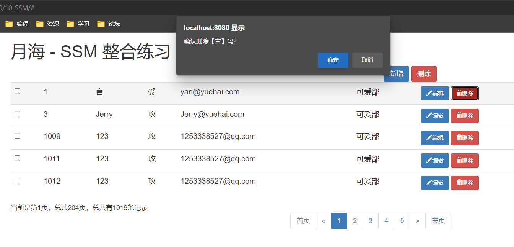

- 删除-逻辑
1. 单个删除
   - URI:/emp/{id} DELETE
2. 批量删除
---
1. EmployeeService
```java
    /**
     * 根据 id 删除单个员工
     * @param id
     */
    void deleteEmp(Integer id);

    /**
     * 根据 id 删除单个员工
     * @param del_ids
     */
    void deleteBatch(List<Integer> del_ids);
```
2. EmployeeServiceImpl
```java
    @Override
    public void deleteEmp(Integer id) {
        // 根据主键删除
        employeeMapper.deleteByPrimaryKey(id);
    }

    @Override
    public void deleteBatch(List<Integer> del_ids) {
        // 创建 EmployeeExample 对象，此查询方法需要
        EmployeeExample employeeExample = new EmployeeExample();
        EmployeeExample.Criteria criteria = employeeExample.createCriteria();
        // 拼装后的语句为：delete from xxx where emp_id in(1,2,3)
        // 调用此方法拼装条件，使查询的员工 id 必须等于传进来的值
        criteria.andEmpIdIn(del_ids);
        // 根据主键进行有选择的删除
        employeeMapper.deleteByExample(employeeExample);
    }
```
3. EmployeeController
```java
    /**
     * 单个批量删除二合一
     * 批量删除：1-2-3，传入多个 id
     * 单个删除：1，传入一个 id
     */
    // RESTful 风格的 URI，请求方式为：DELETE，删除
    @RequestMapping(value="/emp/{ids}",method=RequestMethod.DELETE)
    // @ResponseBody用于标识一个控制器方法，
    // 可以将该方法的返回值直接作为响应报文的响应体响应到浏览器
    @ResponseBody
    // 将传入的员工一个或多个员工 id 赋值给 ids
    public Msg deleteEmp(@PathVariable("ids")String ids){
        // 判断传入的参数是否带'-'横线（是否为多个值）
        if(ids.contains("-")){
            // 带则为批量删除
            // 将 ids 按照 '-' 进行分割，转为数组
            String[] str_ids = ids.split("-");

            // 创建集合，用来保存多个员工 id
            List<Integer> del_ids = new ArrayList<>();
            // 遍历，将 id 添加到集合中
            for (String id : str_ids) {
                // 强转为 Integer 类型并添加入集合
                del_ids.add(Integer.parseInt(id));
            }
            // 调用批量删除的方法
            employeeService.deleteBatch(del_ids);
        }else{
            // 不带则为单个删除
            // 将传入的参数强转为 Integer 类型并赋值给 id
            Integer id = Integer.parseInt(ids);
            // 调用单个删除的方法
            employeeService.deleteEmp(id);
        }
        // 返回处理成功（状态码100）
        return Msg.success();
    }
```
4. list2.jsp
```java
    <%@ page contentType="text/html;charset=UTF-8" language="java" %>
    <html>
    <head>
        <meta charset="utf-8">
        <meta http-equiv="X-UA-Compatible" content="IE=edge">
        <meta name="viewport" content="width=device-width, initial-scale=1">
        <!-- 上述3个meta标签*必须*放在最前面，任何其他内容都*必须*跟随其后！ -->

        <title>员工列表 Plus</title>

        <!-- Bootstrap 引入在线的 css 样式 -->
        <link rel="stylesheet" href="https://stackpath.bootstrapcdn.com/bootstrap/3.4.1/css/bootstrap.min.css"
            integrity="sha384-HSMxcRTRxnN+Bdg0JdbxYKrThecOKuH5zCYotlSAcp1+c8xmyTe9GYg1l9a69psu"
            crossorigin="anonymous">

        <!-- Bootstrap 引入在线的 jQuery 和 Bootstrap 的所有 JavaScript 插件 -->
        <!-- jQuery (Bootstrap 的所有 JavaScript 插件都依赖 jQuery，所以必须放在前边) -->
        <script src="https://fastly.jsdelivr.net/npm/jquery@1.12.4/dist/jquery.min.js"
                integrity="sha384-nvAa0+6Qg9clwYCGGPpDQLVpLNn0fRaROjHqs13t4Ggj3Ez50XnGQqc/r8MhnRDZ"
                crossorigin="anonymous">
        </script>
        <!-- 加载 Bootstrap 的所有 JavaScript 插件。你也可以根据需要只加载单个插件。 -->
        <script src="https://stackpath.bootstrapcdn.com/bootstrap/3.4.1/js/bootstrap.min.js"
                integrity="sha384-aJ21OjlMXNL5UyIl/XNwTMqvzeRMZH2w8c5cRVpzpU8Y5bApTppSuUkhZXN0VxHd"
                crossorigin="anonymous">
        </script>

        <%-- 获取当前站点的根路径，赋值给 APP_PATH --%>
        <%
            pageContext.setAttribute("APP_PATH", request.getContextPath());
        %>

        <%-- 页面跳转，查询数据，解析 json，调用 Ajax --%>
        <script type="text/javascript">

            // 定义一个总记录数 和 当前页码数，方便之后的使用
            var totalRecord,currentPage;

            // 页面加载完成以后，调用页面跳转方法，解析数据
            $(function () {
                // 调用跳转方法，跳到第一页
                to_page(1);
            });

            // 抽取 Ajax 页面跳转及解析 json 数据的方法，便于调用
            // 参数 pn 为要跳转到的页码数
            function to_page(pn) {
                $.ajax({
                    // 请求地址为：工程路径/getEmps2
                    url: "${APP_PATH}/getEmps2",
                    // 请求参数
                    data: "pn=" + pn,
                    // 请求方式 GET
                    type: "GET",
                    // result：服务器返回的数据
                    success: function (result) {
                        // 1、解析并显示员工数据
                        build_emps_table(result);
                        // 2、解析并显示分页信息
                        build_page_info(result);
                        // 3、解析显示分页条数据
                        build_page_nav(result);
                    }
                });
            }

            // 1、解析并显示员工数据
            function build_emps_table(result) {
                //清空员工数据表格，否则本次数据会与上一次的数据叠加，导致页面混乱
                $("#emps_table tbody").empty();

                // 分页数据都在 extend 对象中的 pageInfo 对象中的 list 数组中
                var emps = result.extend.pageInfo.list;
                // 遍历 list 员工数据，参数1：要遍历的数据，参数2：回调函数
                // 回调函数参数1：索引；参数2：当前遍历的数据对象
                $.each(emps, function (index, item) {
                    // 每条数据前面的复选框
                    var checkBoxTd = $("<td><input type='checkbox' class='check_item' /></td>");
                    // 添加 td 标签，并将员工 id 放入其中
                    var empIdTd = $("<td></td>").append(item.empId);
                    // 添加 td 标签，并将员工姓名放入其中
                    var empNameTd = $("<td></td>").append(item.empName);
                    // 添加 td 标签，并将员工性别放入其中，以三元运算符改变参数
                    var genderTd = $("<td></td>").append(item.gender == '0' ? '受' : '攻');
                    // 添加 td 标签，并将员工邮箱放入其中
                    var emailTd = $("<td></td>").append(item.email);
                    // 添加 td 标签，并将员工部门放入其中
                    var deptNameTd = $("<td></td>").append(item.department.deptName);

                    // 编辑按钮，先添加 button 标签，再添加其 class 属性，然后添加 span 标签，再添加其 class 属性
                    // 最后在 span 标签中加入【编辑】文字
                    var editBtn = $("<button></button>").addClass("btn btn-primary btn-sm edit_btn")
                        .append($("<span></span>").addClass("glyphicon glyphicon-pencil")).append("编辑");
                    // 为编辑按钮添加一个自定义的属性，来表示当前员工 id
                    editBtn.attr("edit-id", item.empId);

                    // 删除按钮
                    var delBtn = $("<button></button>").addClass("btn btn-danger btn-sm delete_btn")
                        .append($("<span></span>").addClass("glyphicon glyphicon-trash")).append("删除");
                    // 为删除按钮添加一个自定义的属性来表示当前删除的员工 id
                    delBtn.attr("del-id", item.empId);

                    // 将编辑按钮与删除按钮添加到 td 标签中，两个按钮
                    var btnTd = $("<td></td>").append(editBtn).append(" ").append(delBtn);

                    // 将上面这些对象都添加到 id 为 emps_table 的标签的 tbody 标签的 tr 标签中
                    $("<tr></tr>").append(checkBoxTd)
                        .append(empIdTd)
                        .append(empNameTd)
                        .append(genderTd)
                        .append(emailTd)
                        .append(deptNameTd)
                        .append(btnTd)
                        // 选择 id 为 emps_table 的标签的 tbody 标签中
                        .appendTo("#emps_table tbody");
                });
            }

            // 2、解析并显示分页文字信息，当前是第几页、总记录数等
            function build_page_info(result) {
                //清空分页文字信息，否则本次数据会与上一次的数据叠加，导致页面混乱
                $("#page_info_area").empty();

                // 创建分页文字信息，将其添加到 id 为 page_info_area 的标签中
                $("#page_info_area").append("当前是第" + result.extend.pageInfo.pageNum + "页，总共" +
                    result.extend.pageInfo.pages + "页，总共有" +
                    result.extend.pageInfo.total + "条记录");

                // 给定义的总记录数赋值，方便之后的操作
                totalRecord = result.extend.pageInfo.total;
                // 给定义的当前页码赋值，方便之后的操作
                currentPage = result.extend.pageInfo.pageNum;
            }

            // 3、解析显示分页条数据
            function build_page_nav(result) {
                //清空分页条数据，否则本次数据会与上一次的数据叠加，导致页面混乱
                $("#page_nav_area").empty();

                // 创建下面这些 li 元素的父元素 ul
                var ul = $("<ul></ul>").addClass("pagination");

                // 首页，添加 li 标签，在其中添加 a 标签并在其中添加【首页】，并设置a 标签的 href 属性
                var firstPageLi = $("<li></li>").append($("<a></a>").append("首页").attr("href", "#"));
                // 上一页
                var prePageLi = $("<li></li>").append($("<a></a>").append("&laquo;"));
                // 判断当前页是否有前页（是否是第一页）
                if (result.extend.pageInfo.hasPreviousPage == false) {
                    // 是的话给 首页 和 上一页 添加 class 样式：disabled，使其不可点击
                    firstPageLi.addClass("disabled");
                    prePageLi.addClass("disabled");
                } else {
                    // 不是的话为元素添加点击翻页的事件
                    firstPageLi.click(function () {
                        // 跳转到第一页
                        to_page(1);
                    });
                    prePageLi.click(function () {
                        // 跳转到当前页的下一页
                        to_page(result.extend.pageInfo.pageNum - 1);
                    });
                }
                // 将 首页 和 上一页 添加到 ul 标签中
                ul.append(firstPageLi).append(prePageLi);

                // 使用遍历给 ul 标签中添加页码提示，1、2、3、4、5 数字导航分页条
                // 回调函数参数1：索引；参数2：当前遍历的数据对象
                $.each(result.extend.pageInfo.navigatepageNums, function (index, item) {
                    // 将 a 标签添加到 li 标签中，并在其中加入本次遍历出来的数据
                    var numLi = $("<li></li>").append($("<a></a>").append(item));
                    // 判断本次遍历出来的数据和本页的页码数是否相同
                    if (result.extend.pageInfo.pageNum == item) {
                        // 相同则添加 class 样式：active，使其高亮
                        numLi.addClass("active");
                    }
                    // 添加点击事件
                    numLi.click(function () {
                        to_page(item);
                    });
                    // 在 ul 标签中添加本次循环的 li 标签
                    ul.append(numLi);
                });

                // 下一页
                var nextPageLi = $("<li></li>").append($("<a></a>").append("&raquo;"));
                // 末页
                var lastPageLi = $("<li></li>").append($("<a></a>").append("末页").attr("href", "#"));
                // 判断当前页是否有下页（是否是最后一页）
                if (result.extend.pageInfo.hasNextPage == false) {
                    // 是的话给 末页 和 下一页 添加 class 样式：disabled，使其不可点击
                    nextPageLi.addClass("disabled");
                    lastPageLi.addClass("disabled");
                } else {
                    // 不是的话为元素添加点击翻页的事件
                    nextPageLi.click(function () {
                        to_page(result.extend.pageInfo.pageNum + 1);
                    });
                    lastPageLi.click(function () {
                        // 跳转到最后一页
                        to_page(result.extend.pageInfo.pages);
                    });
                }
                // 将 下一页 和 末页 添加到 ul 标签中
                ul.append(nextPageLi).append(lastPageLi);

                // 将 ul 标签添加到 id 为 page_nav_area 的标签的 nav 标签中
                $("<nav></nav>").append(ul).appendTo("#page_nav_area");
            }

        </script>

    </head>
    <body>

    <!-- 员工添加的模态框，点击新增按钮调用 js 方法，使其弹出 -->
    <div class="modal fade" id="empAddModal" tabindex="-1" role="dialog" aria-labelledby="myModalLabel">
        <div class="modal-dialog" role="document">
            <div class="modal-content">
                <%-- 模态框最上方显示的 员工添加 文字 --%>
                <div class="modal-header">
                    <button type="button" class="close" data-dismiss="modal" aria-label="Close"><span aria-hidden="true">&times;</span>
                    </button>
                    <h4 class="modal-title" id="myModalLabel">员工添加</h4>
                </div>

                <div class="modal-body">
                    <%-- form 表单 --%>
                    <form class="form-horizontal">
                        <%-- 员工姓名 --%>
                        <div class="form-group">
                            <label class="col-sm-2 control-label">员工姓名</label>
                            <div class="col-sm-10">
                                <%-- 员工姓名输入框 --%>
                                <input type="text" name="empName" class="form-control" id="empName_add_input"
                                    placeholder="empName">
                                <span class="help-block"></span>
                            </div>
                        </div>
                        <%-- 员工邮箱 --%>
                        <div class="form-group">
                            <label class="col-sm-2 control-label">员工邮箱</label>
                            <div class="col-sm-10">
                                <%-- 员工邮箱输入框 --%>
                                <input type="text" name="email" class="form-control" id="email_add_input"
                                    placeholder="email@yuehai.com">
                                <span class="help-block"></span>
                            </div>
                        </div>
                        <%-- 员工攻受 --%>
                        <div class="form-group">
                            <label class="col-sm-2 control-label">员工攻受</label>
                            <div class="col-sm-10">
                                <%-- 员工攻受单选框 --%>
                                <label class="radio-inline">
                                    <input type="radio" name="gender" id="gender1_add_input" value="1" checked="checked"> 攻
                                </label>
                                <label class="radio-inline">
                                    <input type="radio" name="gender" id="gender2_add_input" value="0"> 受
                                </label>
                            </div>
                        </div>
                        <%-- 所在部门 --%>
                        <div class="form-group">
                            <label class="col-sm-2 control-label">所在部门</label>
                            <div class="col-sm-4">
                                <!-- 查出来的部门下拉单选框，部门提交部门id即可 -->
                                <select class="form-control" name="dId" id="dept_add_select"></select>
                            </div>
                        </div>
                    </form>
                </div>
                <!-- 部门提交部门id即可 -->
                <div class="modal-footer">
                    <button type="button" class="btn btn-default" data-dismiss="modal">关闭</button>
                    <button type="button" class="btn btn-primary" id="emp_save_btn">保存</button>
                </div>
            </div>
        </div>
    </div>

    <!-- 员工修改的模态框，点击编辑按钮调用 js 方法，使其弹出 -->
    <div class="modal fade" id="empUpdateModal" tabindex="-1" role="dialog" aria-labelledby="myModalLabel">
        <div class="modal-dialog" role="document">
            <div class="modal-content">
                <%-- 模态框最上方显示的 员工修改 文字 --%>
                <div class="modal-header">
                    <button type="button" class="close" data-dismiss="modal" aria-label="Close"><span aria-hidden="true">&times;</span>
                    </button>
                    <h4 class="modal-title">员工修改</h4>
                </div>

                <div class="modal-body">
                    <%-- form 表单 --%>
                    <form class="form-horizontal">
                        <%-- 员工姓名 --%>
                        <div class="form-group">
                            <label class="col-sm-2 control-label">员工姓名</label>
                            <div class="col-sm-10">
                                <%-- 员工姓名展示框，不可修改 --%>
                                <p class="form-control-static" id="empName_update_static"></p>
                                <span class="help-block"></span>
                            </div>
                        </div>
                        <%-- 员工邮箱 --%>
                        <div class="form-group">
                            <label class="col-sm-2 control-label">员工邮箱</label>
                            <div class="col-sm-10">
                                <%-- 员工邮箱输入框 --%>
                                <input type="text" name="email" class="form-control" id="email_update_input"
                                    placeholder="email@yuehai.com">
                                <span class="help-block"></span>
                            </div>
                        </div>
                        <%-- 员工攻受 --%>
                        <div class="form-group">
                            <label class="col-sm-2 control-label">员工攻受</label>
                            <div class="col-sm-10">
                                <%-- 员工攻受单选框 --%>
                                <label class="radio-inline">
                                    <input type="radio" name="gender" id="gender1_update_input" value="1" checked="checked"> 攻
                                </label>
                                <label class="radio-inline">
                                    <input type="radio" name="gender" id="gender2_update_input" value="0"> 受
                                </label>
                            </div>
                        </div>
                        <%-- 所在部门 --%>
                        <div class="form-group">
                            <label class="col-sm-2 control-label">所在部门</label>
                            <div class="col-sm-4">
                                <!-- 查出来的部门下拉单选框，部门提交部门id即可 -->
                                <select class="form-control" name="dId" id="dept_update_select"></select>
                            </div>
                        </div>
                    </form>
                </div>
                <!-- 部门提交部门id即可 -->
                <div class="modal-footer">
                    <button type="button" class="btn btn-default" data-dismiss="modal">关闭</button>
                    <button type="button" class="btn btn-primary" id="emp_update_btn">修改</button>
                </div>
            </div>
        </div>
    </div>

    <!-- 搭建显示页面 -->
    <div class="container">

        <!-- 标题 -->
        <div class="row">
            <div class="col-md-12">
                <h1>月海 - SSM 整合练习</h1>
            </div>
        </div>

        <!-- 按钮 -->
        <div class="row">
            <div class="col-md-4 col-md-offset-8">
                <button class="btn btn-primary" id="emp_add_modal_btn">新增</button>
                <button class="btn btn-danger" id="emp_delete_all_btn">删除</button>
            </div>
        </div>

        <!-- 显示表格数据 -->
        <div class="row">
            <div class="col-md-12">
                <table class="table table-hover" id="emps_table">
                    <tr>
                        <th>
                            <%-- 复选框，点击使得选择本页所有数据 --%>
                            <input type="checkbox" id="check_all" />
                        </th>
                        <th>id</th>
                        <th>员工姓名</th>
                        <th>员工性别</th>
                        <th>员工邮箱</th>
                        <th>所在部门</th>
                        <th>操作</th>
                    </tr>

                </table>
            </div>
        </div>

        <!-- 显示分页信息 -->
        <div class="row">
            <!--分页文字信息  -->
            <div class="col-md-6" id="page_info_area"></div>
            <!-- 分页条信息 -->
            <div class="col-md-6" id="page_nav_area"></div>
        </div>

    </div>

    </body>

    <%-- 点击弹出模态框，进行增删改，此类 js 需放在页面内容的下方 --%>
    <script type="text/javascript">

        // 清空表单样式及内容，传入的参数为选择器
        function reset_form(ele){
            // 将 jq 对象转换为 js 对象以使用 reset() 方法，重置表单内容
            $(ele)[0].reset();
            // 清空传入的选择器中的所有的这两种表单样式
            $(ele).find("*").removeClass("has-error has-success");
            // 清空传入的选择器中 class 属性为 help-block 的文本内容
            $(ele).find(".help-block").text("");
        }

        // 点击新增按钮弹出员工添加的模态框，
        // 需放在按钮内容下面，不然加载此 js 时按钮还没加载，无法绑定
        $("#emp_add_modal_btn").click(function () {
            // 每次模态框弹出都清除表单数据，表单完整重置（表单的数据，表单的样式）
            // 调用 reset_form 方法清空数据
            reset_form("#empAddModal form");

            // 调用 getDepts 方法发送ajax请求，查出部门信息，
            // 将其显示在 id 为 dept_add_select （下拉列表）的标签中
            getDepts("#dept_add_select");

            // 调用 modal 方法弹出模态框
            $("#empAddModal").modal({
                // 打开模态框时点击背景不关闭模态框
                backdrop: "static"
            });
        });

        // 查出所有的部门信息并显示在下拉列表中方法
        function getDepts(ele){
            // 清空之前下拉列表的值
            $(ele).empty();

            // 发送 ajax 请求
            $.ajax({
                // 请求地址
                url:"${APP_PATH}/getDepts",
                // 请求方式 GET
                type:"GET",
                // 请求成功以后，处理返回的数据
                success:function(result){
                    // 遍历 depts 部门信息，参数1：要遍历的数据，参数2：回调函数
                    // 遍历的回调函数也可以不写参数，这样就用 this 表示本次遍历的对象
                    $.each(result.extend.depts,function(){
                        // 在 option 标签中加入本次遍历的 deptName，并添加属性 value 值为 本次遍历的 deptId
                        var optionEle = $("<option></option>").append(this.deptName).attr("value",this.deptId);
                        // 将本次遍历的数据添加到 id 为 ele（传入的参数）的标签中
                        optionEle.appendTo(ele);
                    });
                }
            });
        }

        // 显示校验结果的提示信息方法，传入 status 表示成功，其他为失败
        // 参数1：选择器名称；参数2：成功还是失败；参数3：提示的内容
        function show_validate_msg(ele,status,msg){
            // 清除当前元素的校验状态
            $(ele).parent().removeClass("has-success has-error");
            // 清除 span 标签中显示的文本内容
            $(ele).next("span").text("");

            // 判断成功还是失败
            if("success"==status){
                $(ele).parent().addClass("has-success");
                $(ele).next("span").text(msg);
            }else if("error" == status){
                $(ele).parent().addClass("has-error");
                $(ele).next("span").text(msg);
            }
        }

        // 点击确定按钮后校验表单数据方法
        function validate_add_form(){
            // 拿到要校验的数据，使用正则表达式
            // 1、校验员工姓名信息
            var empName = $("#empName_add_input").val();
            // 规则：6-16 位英文字母和数字或 2-5 位中文的组合
            var regName = /(^[a-zA-Z0-9_-]{6,16}$)|(^[\u2E80-\u9FFF]{2,5})/;
            // 判断是否满足规则
            if(!regName.test(empName)){
                // 不满足规则的提示，调用 show_validate_msg 方法
                show_validate_msg("#empName_add_input", "error", "用户名可以是2-5位中文或者6-16位英文和数字的组合");
                // 跳出方法
                return false;
            }else{
                // 满足规则的提示，调用 show_validate_msg 方法
                show_validate_msg("#empName_add_input", "success", "");
            };

            // 2、校验邮箱信息
            var email = $("#email_add_input").val();
            var regEmail = /^([a-z0-9_\.-]+)@([\da-z\.-]+)\.([a-z\.]{2,6})$/;
            // 判断是否满足规则
            if(!regEmail.test(email)){
                // 不满足规则的提示，调用 show_validate_msg 方法
                show_validate_msg("#email_add_input", "error", "邮箱格式不正确");
                // 跳出方法
                return false;
            }else{
                // 满足规则的提示，调用 show_validate_msg 方法
                show_validate_msg("#email_add_input", "success", "");
            }
            // 都没有错误，返回 true
            return true;
        }

        // 离开焦点事件，发送 ajax 请求校验用户名是否可用
        $("#empName_add_input").change(function(){
            // 获取当前标签中 value 属性的值
            var empName = this.value;

            // 发送 ajax 请求校验用户名是否可用
            $.ajax({
                // 请求地址
                url:"${APP_PATH}/checkuser",
                // 请求方式 GET
                type:"GET",
                // 请求的参数
                data:"empName=" + empName,
                // 请求成功以后，处理返回的数据
                success:function(result){
                    // 判断返回的状态码是否为 100
                    if(result.code==100){
                        // 是则说明数据库中没有此员工，可以添加
                        // 满足规则的提示，调用 show_validate_msg 方法
                        show_validate_msg("#empName_add_input","success","用户名可用");
                        // 给保存按钮一个自定义的属性，让我们可以知道校验用户名的结果
                        $("#emp_save_btn").attr("ajax-va","success");
                    }else{
                        // 不是则说明数据库中有此员工，不可以添加
                        // 不满足规则的提示，调用 show_validate_msg 方法
                        show_validate_msg("#empName_add_input","error",result.extend.va_msg);
                        // 给保存按钮一个自定义的属性，让我们可以知道校验用户名的结果
                        $("#emp_save_btn").attr("ajax-va","error");
                    }
                }
            });
        });

        // 点击保存按钮，添加员工
        $("#emp_save_btn").click(function(){
            // 一、模态框中填写的表单数据提交给服务器进行保存
            // 1、对提交给服务器的数据进行 js 校验，调用 validate_add_form 方法判断其返回值
            if(!validate_add_form()){
                // 返回值为 false 则跳出方法
                return false;
            };
            // 2、判断之前的，离开焦点事件，发送 ajax 请求校验用户名是否可用
            // 判断保存按钮的 ajax-va 属性的值是否为 error，之前设置的值
            if($(this).attr("ajax-va")=="error"){
                // 为 error 跳出方法
                return false;
            }

            // 二、发送ajax请求保存员工
            $.ajax({
                // 请求地址
                url:"${APP_PATH}/emp",
                // 请求方式 POST
                type:"POST",
                // 请求的参数：empAddModal 的标签中的 form 标签序列化之后的数据
                // serialize()：将表单中的数据序列化
                data:$("#empAddModal form").serialize(),
                // 请求成功以后，处理返回的数据
                success:function(result){
                    // 判断返回的状态码是否为 100
                    if(result.code == 100){
                        // 是则说明员工保存成功；
                        // 1、关闭模态框
                        $("#empAddModal").modal('hide');

                        // 2、调用最开始定义的总记录数，来到最后一页，
                        // 显示刚才保存的数据，发送 ajax 请求显示最后一页数据即可
                        to_page(totalRecord);
                    }
                    else{
                        // 不是则显示显示失败信息
                        // 有哪个字段的错误信息就显示哪个字段的；undefined：空
                        if(undefined != result.extend.errorFields.empName){
                            //显示员工名字的错误信息
                            show_validate_msg("#empName_add_input", "error", result.extend.errorFields.empName);
                        }
                        if(undefined != result.extend.errorFields.email){
                            //显示邮箱错误信息
                            show_validate_msg("#email_add_input", "error", result.extend.errorFields.email);
                        }
                    }
                }
            });
        });

        // 点击编辑按钮，打开编辑模态框
        // 我们是按钮创建之前就绑定了click，所以绑定不上（页面加载完成之后由Ajax创建的按钮）
        // 1、可以在创建按钮的时候绑定
        // 2、绑定点击.live()，jquery新版没有live，使用on进行替代（此处使用此方法）
        // 在整个文档中（document）的 class 属性中有 edit_btn 值的标签绑定单击事件（click）
        $(document).on("click",".edit_btn",function(){
            // 1、查出部门信息，并显示部门列表
            getDepts("#empUpdateModal select");
            // 2、查出员工信息，传入员工 id，显示员工信息
            getEmp($(this).attr("edit-id"));

            //3、把员工的 id 传递给模态框的更新按钮
            $("#emp_update_btn").attr("edit-id",$(this).attr("edit-id"));

            // 4、打开模态框
            $("#empUpdateModal").modal({
                backdrop:"static"
            });
        });

        // 查出员工信息，显示员工信息
        function getEmp(id){
            // 发送 ajax 请求查询员工信息
            $.ajax({
                // 请求地址，传入员工 id
                url:"${APP_PATH}/emp/"+id,
                // 请求方式 GET
                type:"GET",
                // 请求成功以后，处理返回的数据
                success:function(result){
                    // 获取返回的 emp 对象并赋值给 empData
                    var empData = result.extend.emp;
                    // 取出对象中的数据赋值给相应的元素
                    $("#empName_update_static").text(empData.empName);
                    $("#email_update_input").val(empData.email);
                    // id 为 empUpdateModal 的标签中的 input 标签中的
                    // 属性 name 的值为 gender 的标签赋值
                    $("#empUpdateModal input[name=gender]").val([empData.gender]);
                    $("#empUpdateModal select").val([empData.dId]);
                }
            });
        }

        // 点击更新，更新员工信息
        $("#emp_update_btn").click(function(){
            // 验证邮箱是否合法
            // 1、校验邮箱信息
            var email = $("#email_update_input").val();
            var regEmail = /^([a-z0-9_\.-]+)@([\da-z\.-]+)\.([a-z\.]{2,6})$/;
            if(!regEmail.test(email)){
                show_validate_msg("#email_update_input", "error", "邮箱格式不正确");
                return false;
            }else{
                show_validate_msg("#email_update_input", "success", "");
            }

            // 2、发送 ajax 请求保存更新的员工数据
            $.ajax({
                // 请求地址，传入员工 id
                url:"${APP_PATH}/emp/"+$(this).attr("edit-id"),
                // 请求方式 PUT
                type:"PUT",
                // 请求的参数：empAddModal 的标签中的 form 标签序列化之后的数据
                // serialize()：将表单中的数据序列化
                data:$("#empUpdateModal form").serialize(),
                // 请求成功以后，处理返回的数据
                success:function(result){
                    // 1、关闭模态框
                    $("#empUpdateModal").modal("hide");
                    // 2、回到本页面
                    to_page(currentPage);
                }
            });
        });

        // 点击删除按钮，单个删除
        // 我们是按钮创建之前就绑定了click，所以绑定不上（页面加载完成之后由Ajax创建的按钮）
        // 1、可以在创建按钮的时候绑定
        // 2、绑定点击.live()，jquery新版没有live，使用on进行替代（此处使用此方法）
        // 在整个文档中（document）的 class 属性中有 delete_btn 值的标签绑定单击事件（click）
        $(document).on("click",".delete_btn",function(){
            // 1、弹出是否确认删除对话框
            // 当前按钮的父元素中的 tr 元素里的第 2 个 td 元素中的文本内容，赋值给 empName
            var empName = $(this).parents("tr").find("td:eq(2)").text();
            var empId = $(this).attr("del-id");

            // 判断用户点击的确定还是取消
            // confirm：提示框，用户点击 true 则返回 true，点击 false 则返回 false
            if(confirm("确认删除【"+empName+"】吗？")){
                // 确认，发送ajax请求删除即可
                $.ajax({
                    // 请求地址，传入员工 id
                    url:"${APP_PATH}/emp/" + empId,
                    // 请求方式 DELETE
                    type:"DELETE",
                    // 请求成功以后，处理返回的数据
                    success:function(result){
                        // 弹窗提示返回的提示信息
                        alert(result.msg);
                        // 回到本页
                        to_page(currentPage);
                    }
                });
            }
        });

        // 完成点击最上面的复选框的 全选/全不选 功能
        $("#check_all").click(function(){
            // attr 获取 checked 是 undefined
            // 我们这些 dom 原生的属性；attr获取自定义属性的值；
            // prop 可以修改和读取 dom 原生属性的值
            // 为 class 属性为 check_item 的 checked 属性赋值为此复选框的 checked 的值
            $(".check_item").prop("checked",$(this).prop("checked"));
        });

        // 为每条数据前的复选框添加
        $(document).on("click",".check_item",function(){
            // 判断当前选择中的元素是否全部和本页所有复选框的个数相等
            // .check_item:checked：class 属性为 check_item 的所有被选中（checked）的复选框
            // $(".check_item:checked").length：class 属性为 check_item 的所有被选中（checked）的复选框的个数
            // $(".check_item").length：class 属性为 check_item 的复选框的个数
            var flag = $(".check_item:checked").length==$(".check_item").length;
            // 将 flag 赋值给 id 为 check_all 的标签的 checked 属性
            // 若是以全选，则最上面的复选框页会自动选择
            // 若是未全选，则最上面的复选框页会自动取消选择
            $("#check_all").prop("checked",flag);
        });

        // 点击全部删除，就批量删除
        $("#emp_delete_all_btn").click(function(){
            // 赋一个初始值
            var empNames = "";
            var del_idstr = "";

            // 遍历每一个被选中的元素
            $.each($(".check_item:checked"),function(){
                // this：代表当前正在被遍历的元素（复选框）
                // 组装员工姓名字符串
                // 当前复选框的父元素中的 tr 元素里的第 2 个 td 元素的文本，并在后面加一个','
                empNames += $(this).parents("tr").find("td:eq(2)").text() + ",";
                // 组装员工 id 字符串
                del_idstr += $(this).parents("tr").find("td:eq(1)").text() + "-";
            });

            // 去除 empNames 多余的 ','
            empNames = empNames.substring(0, empNames.length-1);
            // 去除删除的 id 多余的 '-'
            del_idstr = del_idstr.substring(0, del_idstr.length-1);

            // 判断用户点击的确定还是取消
            // confirm：提示框，用户点击 true 则返回 true，点击 false 则返回 false
            if(confirm("确认删除【"+empNames+"】吗？")){
                // 发送 ajax 请求删除
                $.ajax({
                    // 请求地址，传入多个员工的 id
                    url:"${APP_PATH}/emp/"+del_idstr,
                    // 请求方式 DELETE
                    type:"DELETE",
                    // 请求成功以后，处理返回的数据
                    success:function(result){
                        // 弹窗提示返回的提示信息
                        alert(result.msg);
                        // 回到当前页面
                        to_page(currentPage);
                    }
                });
            }
        });

    </script>

    </html>
```


# 九、总结

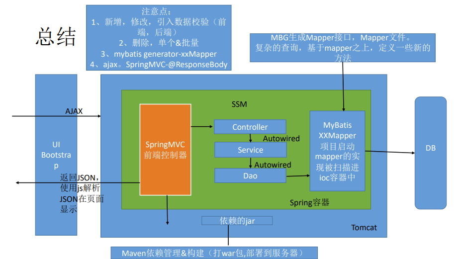